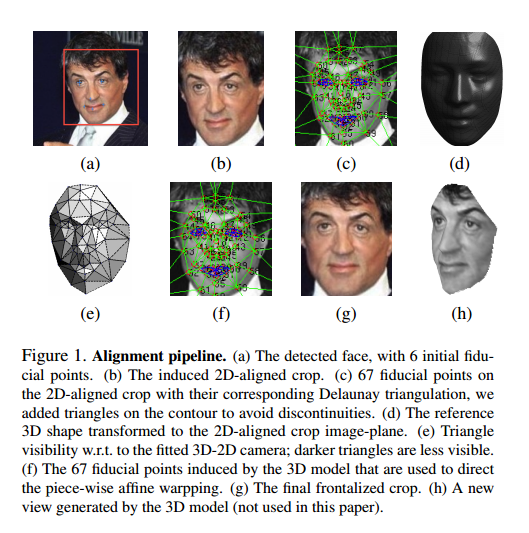
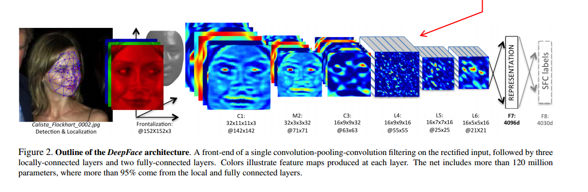
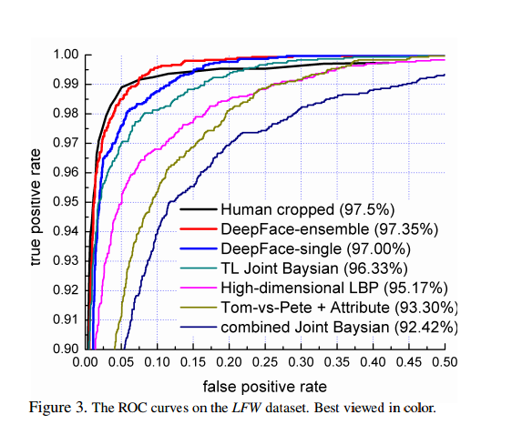
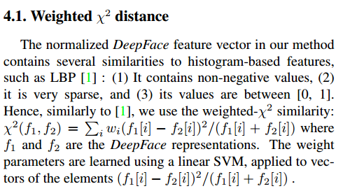
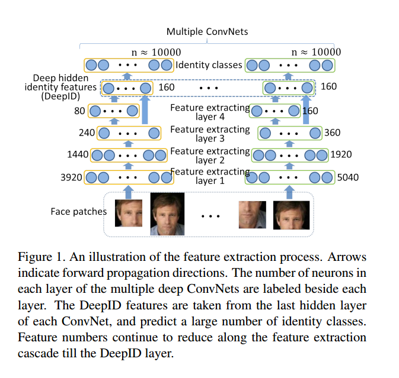
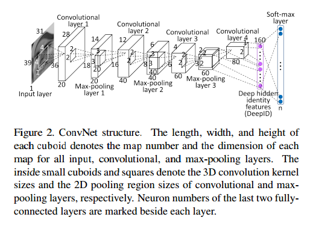
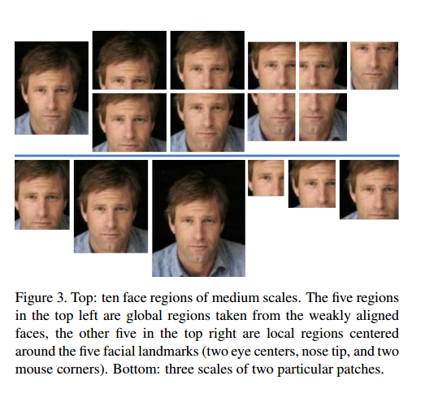
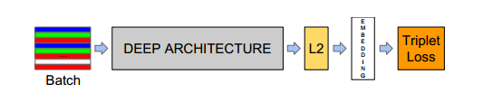
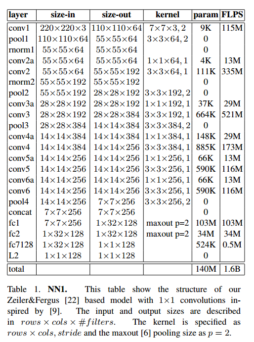
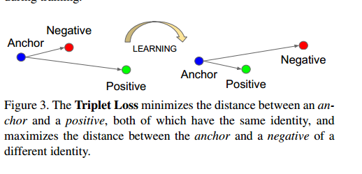

这篇博客主要简单总结下deepLearning在人脸识别方面取得的进展，deepface[^1]，deepid[^2]，facenet[^3]是三个代表工作，由此揭开了deeplearning在人脸识别领域的篇章.

## 1. DeepFace: Closing the Gap to Human-Level Performance in Face Verification

### 简介

如今人脸识别，一般分为四个阶段：人脸检测-人脸对齐-人脸特征表示-人脸识别(分类)。这篇文章从对齐谈到了识别。在人脸对齐阶段使用3D人脸模型通过仿射变换实现对齐，并将对齐后人脸作为9层深度神经网络的输入。与标准CNN不同的是，文章引入局部连接，并在LFW数据集上有97.35%的表现，逼近人类识别人脸水平。

### 3D人脸对齐

文章所统对齐方法如下图所示，  
  
如图所述，3D人脸对齐的过程可以分为如下几步：  

* 首先利用人脸检测器得到被检测人脸,并进行人脸剪切。

* 利用人脸67个对齐基准点进行三角形切割，并在边缘加入三角形防止断裂。

* 利用上述的三角形生成3D人脸，通过3D相机得到带有67个基准点的3d模型  

* 利用基准点进行人脸对齐，并向2D平面进行投影，进行人脸剪切，得到最后的对齐人脸  

### 人脸特征提取--DNN结构

文章引入CNN进行人脸特征提取，网络结构如下图所示：
  
在3d人脸对齐的基础上，将对齐结果作为网络输入，C1(convolvation layer 1)具有32个卷积核，并用3x3步长为2的卷积层代替maxpool,而在后续C2、C3中未使用pool操作，为避免pool带来的信息丢失，如面部局部精确信息和细微纹理。前三层卷积层目的在于提取底层特征，如简单边缘和纹理特征，而Max-pooling layer使得CNN对局部变化更鲁棒，对齐的人脸使得模型对小的注册错误具有鲁棒性。对于L4、L5、L6三层作者使用局部连接，类似一个卷积层对应一个滤波器，feature map中每个位置学习不同的卷积权重。因为一张对齐的图片不同区域具有不同的分布，因此卷积的空间稳定性不能保持。如眼睛和眉毛区域所呈现的形态相比于鼻子和嘴巴区域，具有更高的区分性。而如此设计结构并不会增加特征提取的计算负担，仅仅增加训练阶段参数的个数，为应对大量的参数，需要大量的数据。这里的细节，L4连接C3，L5与L6分别于L4局部连接：L5连接31x31区域，L4连接25*25区域，即眉毛和眼睛区域、嘴巴和鼻子区域。对于之后的全连接F7、F8，使用通用的Dropout机制训练，旨在防止过拟合。  
当然，目标函数依旧是交叉熵函数$$\mit L = -\log p_k$$，层与层之间激活函数为ReLU：$$\mit max(0, x)$$，非线性约束应用到每一个卷积层，局部连接层和全连接层，使得整个网络在各层级联之后可提取得到高度非线性特征和稀疏特征。最后阶段，作者对提取到特征进行Normaliazyion，将其归一化至$$[0, 1]$$目的在于减弱模型对明暗环境变化的敏感性，即将特征的每个元素除以训练序列中该成分所对应的最大值，然后进行标准的归一化：  
$$\cal f(I) = G^{c}(I)/||G^{c}(I)||_2,\ where\ G^{c}(I)_i = G(I)_i/\max (G_i, \gamma)$$,  
$$\gamma$$的目的在于避免除以一个很小的数。贴一下结果图  
当然，文章不仅仅限于人脸识别，同样对人脸验证(verification)做出了分析，引入了距离函数.直接上图：  

## 2.DeepID (Deep Learning Face Representation from Predicting 10,000 Classes)
---
当前用于人脸验证的算法，大多通过构造完备低层特征表示来实现较好的验证效果。在Deepface之后，cnn在人脸识别、验证应用如雨后春笋般的火热起来，原因在于其可有效的提取高层抽象特征。DeepID则旨在利用CNN网络结构学习高层人脸身份特征信息用于人脸鉴定。献上DeepID网络结构图  
正如图所述，网络结构对训练集合进行特征提取，每个卷积层将人脸的一块作为输入并在低层提取低层局部信息，随着特征提取层的级联，提取到的特征数量持续减少，而特征由局部转向全局。有级联层末端提取得到160维高度紧凑的DeepID包含丰富的身份信息，并直接用于预测身份类别。因此，得到良好的160维deepID是模型训练的最终目的。  
具体ConvNet结构如下图所示：  
  
网络包括四个卷积层提取主要特征，接着全连接DeepId层和softmax输出层表示类别。各层激活函数类似DeepFace，而将Max-pooling layer及C4联合输入到DeepID层($$\color{lime}{maxpooling\ 使用较多，可以改进}$$)对于样本预处理，如下图所示  
  
上面一行分别为人脸全部、人脸上半部分和下半部分进行切分；下面一行为对人脸不同尺度的缩放以及人脸不同patch大小。文章在特征提取阶段训练60个ConvNets，并针对特殊patch和图片窗口滑动分别得到160维DeepID，用于人脸验证阶段，人脸验证阶段详见论文。  
而DeepID2则在DeepID基础上加入身份信号和验证信号，旨在模仿LDA，使得不同的身份尽量分开，相同的身份尽量聚集。

## 3.FaceNet: A Unified Embedding for Face Recognition and Clustering
---
FaceNet创新之处在于抛弃以往的softmax分类层，采用欧氏距离比对方法训练模型，详细网络结构以及参数如下图所示：

  
可以看到，在常用CNN结构时候加入L2归一化层，损失函数使用Triplte:
$$
\cal L = \sum_i^N [||f(x_i^a) - f(x_i^p)||_2^2 - ||f(x_i^a) - f(x_i^n)||_2^2 + \alpha]_+
$$
而模型的目标就是最小化函数$$\cal L$$,即最小化anchor于正类之间的距离，最大化anchor于负类之间的距离，并且使得
$$distance(anchor, positive) + \alpha \lt distance(anchor, negative)$$
形象表示如下图：  

## Reference
---

[^1]: Taigman Y, Yang M, Ranzato M, et al. DeepFace: Closing the Gap to Human-Level Performance in Face Verification[C]// Conference on Computer Vision and Pattern Recognition. 2014:1701-1708.

[^2]: Sun Y, Wang X, Tang X. Deep Learning Face Representation from Predicting 10,000 Classes[C]// Computer Vision and Pattern Recognition. IEEE, 2014:1891-1898.

[^3]: Schroff F, Kalenichenko D, Philbin J. FaceNet: A unified embedding for face recognition and clustering[C]// IEEE Conference on Computer Vision & Pattern Recognition. IEEE, 2015:815-823.
