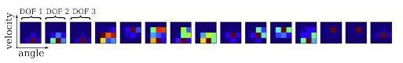

本文主要介绍非负矩阵(NMF)分解在cross-modal task上的应用，简称MCA-NMF[^1][^2]。对于来自不同传感器或接收器的数据，可以获取其之间联系
，如语音、图片、运动等不同模型之间的联系，进而学习其概念特征。文章行文如下：  

* 背景介绍
* NMF在multimodal的用法
* 关于实验

### 背景介绍  
多模学习主要体现在人可以接受多种不同类型的信息，如图片，声音，触觉，味觉等，并可以同时从其中获取有用的信息，通过声音识别出说话人，通
过唇动力接触人说话内容。这些对于人来说较为简单，对于计算机而言，则不是那么容易。 而多模学习的目的则是使计算机可以更好的理解不同模型
的数据，甚至可以利用多个模型的信息整合起来做一些跨模型的任务。在文章[^2]中，作者呈现一种学习框架，即可以同时学习姿态，语句之间的
语义联系，比如挥手表示“再见”，当出现“再见”词语时，可以得到对应得姿态“挥手”，文章进行如下三个实验：

* 识别动作
* 识别单词通过语音
* 得到不同模型之间的关系

就以往工作而言，文章[^1]没有引入标签信息，可以说是无监督学习，不仅学习不同模型之间的关联性，而且学习到可用于表示多模型的对应字典。
接下来，我们就NMF在cross-modal task上的应用详细聊聊。

### 学习多模字典 via NMF

#### 多模型数据的表示以及学习
对于多个模型数据，文章首先将来自不同模型的数据拼接成一个长向量，如下式所示：  

\begin{equation}
V = \begin{pmatrix} v_m & v_s \end{pmatrix}
\end{equation}  

其中$$v_m$$和$$v_s$$分别表示运动向量和语音特征描述向量，$$v$$为$$d$$维向量，是所有模型特征维度的和，总共$$n$$列，表示$$n$$个样本而NMF学习目的是得到两个非负矩阵，
使得$$v^i \approx \sum_{j=1}^{k} h_{i}^{j}w^j$$,其中$$h$$可看做多个模型的关联系数，而$$w$$可看做对应模型的
非负字典。写成向量形式，即  

\begin{equation}
V \approx W \cdot H
\end{equation}

矩阵$$V$$为$$d \times n$$，矩阵$$W$$和$$H$$分别为$$d \times k$$，$$k \times n$$,皆为非负矩阵。对于矩阵分解过程，上篇博文已将，利用分离度代价函数和乘性法则
更新$$W$$和$$H$$,这里的分离度为$$D(V||WH)$$,即目标函数为：

\begin{equation}
\arg\min_{h} D_{I}(v_s, W_sh)
\end{equation}  

而整体矩阵分解过程可以如下图所示：  

   

### 实验
文章利用三种不同模型数据：姿态数据，words和语音，利用NMF来寻找三者之间的关联。如下图  

   

表示一系列动作，挥舞手臂，走路等姿态，作者通过人工映射的方法，如下表，将动作与语句对应起来：  

    

对于特征提取，gesture提取其二维直方图特征，包含姿态的关节角和速度，如下图所示：  

   

其中颜色越亮，响应越大。而MCA问题就可以用下图表示：  

  

通过训练多模型字典，在测试阶段利用一方数据，得到对应特征在另一模型中的对应特征。关于语音处理，则利用MFCC特征进行聚类，得到对应得
HAC特征(Histogram of Acoustic Co-occurence)。在训练得到字典后，cross-modal任务可以如下图所示：  

    

在学习到不同模型字典后，在给出单一模型时，可以通过NMF得到对应的$$H$$，进而利$$H$$可以得到另外的模型。而利用这种思想，可以实现监督学习。
即将标签信息视为一种模型，在矩阵分解时可以得到模型与标签之间的联系，进而在已知模型数据时，可以得到其标签信息，实现监督学习。

### 小结
文章主要关注没标注信息的多模数据之间语义联系的获取，利用NMF巧妙的获取不同模型之间的概念联系。

### Reference
---
[^1]: Mangin O, Filliat D, Ten B L, et al. MCA-NMF: Multimodal Concept Acquisition with Non-Negative Matrix Factorization.[J]. Plos One, 2015, 10(10).
[^2]: Mangin O, Oudeyer P Y. Learning semantic components from subsymbolic multimodal perception[C]// IEEE Third Joint International Conference on Development and Learning and Epigenetic Robotics. 2013:1-7.
