本文主要介绍非负矩阵(NMF)分解,文章行文如下：

### 非负矩阵分解(NMF, Nonnegtive Matrix Factorization)
---
早在1999年，著名的科学杂志《Nature》刊登了两位科学家D.D.Lee和H.S.Seung对数学中非负矩阵研究的突出成果。
其文章为《Learning the parts of objects by non-negative matrix factorization》。关于矩阵的分解有很多种方法，各种方法无非便是
加入各种约束各种条条框框，最后生成一对矩阵相乘的形式来近似表达源矩阵。但在不同的约束下生成的分解矩阵有着不同的性质。下面将在
此论文的基础上对NMF进行介绍。

#### 基本概念  
非负矩阵分解定义为：找到非负矩阵W与H，使得V=WH。然而，在计算中等式两边很难完全相等，因此在求解过程中往往根据某些更新法则迭代
更新出W，H，当等式两边的“距离”满足条件时，停止迭代。

#### 不同矩阵分解方法的对比
在上述论文中，文章利用一张人脸图像来对比三种矩阵分解方法：PCA, VQ, NMF。三者有着相同得表达，皆为
利用矩阵W，H对原始样本V进行逼近。这里V为nxm，即每一列为n维样本，总共m个样本。下面介绍三种方法：  
* 在VQ分解中，每一列的被约束为一个一元矢量。其中只有一个元素为1，其他元素为0。若的第一列中，第r1个元素为1，那么中第一列的脸，
就完全由基图像中的第r1列数据表示。此时得到的基图像称为原型基图像，这些原型图像表示一张原型脸。

* 在PCA分解中，的各列之间相互正交，各行之间相互正交。这个约束比VQ的松弛很多，也就是，中的元素可为正也可为负。中每一张脸的每一个
像素点都是中各列对应的像素点的一个加权和。由于权重矩阵中元素符号的任意性，所以基矩阵表示出来并不像VQ中原型脸那样的直观可解释。
此时将W的列数据画出来并不一定能直接看到一张“脸”。但是在统计上可以解释为最大方差方向，我们把这些“脸”称为“特征脸”

* 在NMF中，由于加了非负约束。与VQ的单一元素不为0不同，NMF允许基图像H间的加权结合来表示脸部图像V；与PCA不同，NMF的加权系数H中的元
素都为非负的。前两者得到的都是一个完整的脸部特征基图像，而NMF得到的是脸部子特征。通俗点说，VQ是用一张完整的图像直接代表源脸部图像
；PCA是将几个完整人脸加减压成一张脸；而NMF是取甲的眼睛，乙的鼻子，丙的嘴巴直接拼成一张脸。这样解释虽然细节上略有不妥，但不失其概
念上的意义。

如下图表示:  

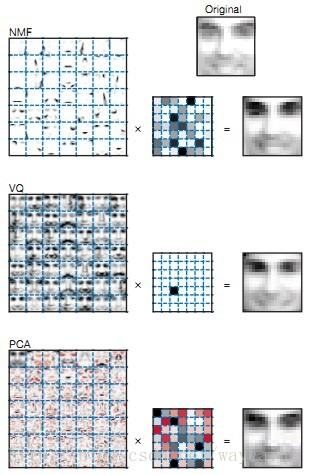

上图的第一个方块为矩阵W，组成的图像。其中每一个小格为W的一列的19x19个元素重构而成的19x19的矩阵图像。第二个方块为H矩阵，其中红
色表示负数，灰黑表示正数， 颜色程度表示大小。右边的图像只是V矩阵的一列的19x19个元素组成的一张原始脸。

#### NMF若干更新法则
关于更新法则，Daniel D. Lee和H. Sebastian Seung的文章《Algorithms for Non-negative Matrix Factorization》有详细的公式推导证明。
由于W与H的乘积是对V的近似估计，所以评价分解好坏的标准便是两者之间的差异。文中在不同的代价函数下提出了不同的更新法则，包括乘性
更新法则与加性更新法则。  

* cost function 1 -- Euclidean distance:  

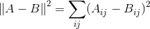

  

在此代价函数下得乘性更新法则有：

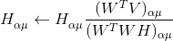

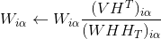

在此代价函数下得加性更新法则有：

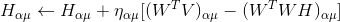

其中，步长为:  

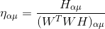

* cost function 2 -- 分离度(divergence):  

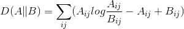

在此代价函数下得乘性更新法则有：

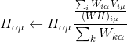

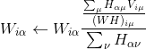

在此代价函数下得加性更新法则有：

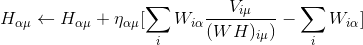

其中，步长为:  

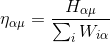

下面是基于欧氏距离的NMF乘性更新方法：

function [W,H]=NMF_EuclideanD(V,r)
% D 输入数据 n（个）* m（维）  r 降维后的维度
%  D=W*H   W 基向量矩阵  H 在基下的坐标向量
sizeD=size(V);   %获取V矩阵维数
n=sizeD(1);
m=sizeD(2);

W=abs(rand(n,r));   %随机产生非负矩阵W与H
H=abs(rand(r,m));

for iterate=1:500
    WD=W'*V;
     WWH=W'*W*H;
     H = H.*WD./WWH; %更新H
%     for a = 1:r
%         for u=1:m
%             H(a,u)=H(a,u)*WD(a,u)/WWH(a,u);
%         end
%     end
    DH=V*H';
    WHH=W*H*H';
    W = W.*DH./WHH;  %更新W
%     for i = 1:n
%         for a=1:r
%             W(i,a)=W(i,a)*DH(i,a)/WHH(i,a);
%         end
%     end

end
d=W*H;    


这里再附一条theano版本的[NMF](https://github.com/saicoco/_practice/tree/master/theano_NMF)
