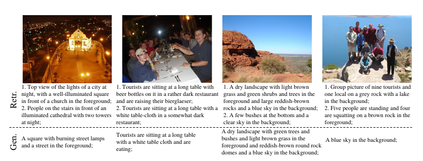
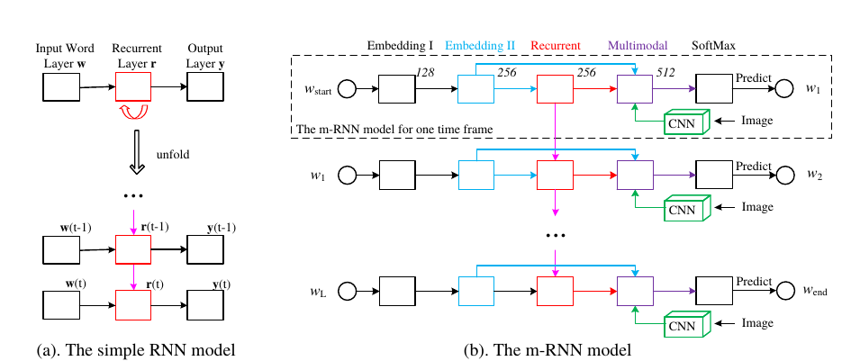

文章[^1]主要完成对于图像生成其内容描述，[项目主页](http://www.stat.ucla.edu/~junhua.mao/m-RNN.html),任务描述如下图所示：　　

　  


　
利用已知图像的描述和对应的图像，训练模型，最终实现给定图片，生成图片描述。
文章使用模型可分为三部分：　　

* word-embeding layers
* RNN
* image-CNN layers　

具体如下图所示：　　


　　


利用`embeding`将句子变成$$2D$$向量，在每个时间步输入一个单词，类似之前mnist操作，每行图片为一个时间步；而对于`CNN`部分，则将原始图片特征进行`tile`
操作，使得在每个时间步对word和vision feature 进行融合，具体可以如代码[tf-n_rnn](https://github.com/mjhucla/TF-mRNN/blob/master/py_lib/tf_mrnn_model.py)
多模型部分：　　


``` python
    self._input_data = tf.placeholder(tf.int32, [batch_size, num_steps])
    self._targets = tf.placeholder(tf.int32, [batch_size, num_steps])
    self._visual_features = tf.placeholder(tf.float32, [batch_size, vf_size])
    self._valid_flags = tf.placeholder(tf.float32, [batch_size, num_steps])
    self._seq_lens = tf.placeholder(tf.int32, [batch_size])

    # Create rnn cell
    if config.rnn_type == 'GRU':
      rnn_cell_basic = tf.nn.rnn_cell.GRUCell(rnn_size)
    elif config.rnn_type == 'LSTM':
      rnn_cell_basic = tf.nn.rnn_cell.LSTMCell(rnn_size, input_size=emb_size,
          use_peepholes=True)
    else:
      raise NameError("Unknown rnn type %s!" % config.rnn_type)
    if is_training and config.keep_prob_rnn < 1:
      rnn_cell_basic = tf.nn.rnn_cell.DropoutWrapper(
          rnn_cell_basic, output_keep_prob=config.keep_prob_rnn)
    cell = tf.nn.rnn_cell.MultiRNNCell([rnn_cell_basic] * config.num_rnn_layers)
    state_size = cell.state_size

    # Create word embeddings
    self._embedding = embedding = tf.get_variable("embedding",
        [vocab_size, emb_size])
    inputs = tf.nn.embedding_lookup(embedding, self._input_data)

    if is_training and config.keep_prob_emb < 1:
      inputs = tf.nn.dropout(inputs, config.keep_prob_emb)

    # Different ways to fuze text and visual information
    if config.multimodal_type == 'mrnn':
      mm_size = config.mm_size
      # Run RNNs
      if flag_reset_state:
        self._initial_state = initial_state = tf.placeholder(tf.float32,
            [batch_size, state_size])
      else:
        self._initial_state = initial_state = cell.zero_state(
            batch_size, tf.float32)
      inputs = [tf.squeeze(input_, [1])
          for input_ in tf.split(1, num_steps, inputs)]
      outputs_rnn, state = tf.nn.rnn(cell, inputs,
          initial_state=initial_state,
          sequence_length=self._seq_lens)
      self._final_state = state
      output_rnn = tf.reshape(tf.concat(1, outputs_rnn), [-1, rnn_size])

      # Map RNN output to multimodal space
      w_r2m = tf.get_variable("w_r2m", [rnn_size, mm_size])
      b_r2m = tf.get_variable("b_r2m", [mm_size])
      multimodal_l = tf.nn.relu(tf.matmul(output_rnn, w_r2m) + b_r2m)

      # Map Visual feature to multimodal space
      w_vf2m = tf.get_variable("w_vf2m", [vf_size, mm_size])
      b_vf2m = tf.get_variable("b_vf2m", [mm_size])
      mm_vf_single = tf.nn.relu(
          tf.matmul(self._visual_features, w_vf2m) + b_vf2m)
      mm_vf = tf.reshape(tf.tile(mm_vf_single, [1, num_steps]), [-1, mm_size])
      multimodal_l = multimodal_l + mm_vf
      if is_training and config.keep_prob_mm < 1:
        multimodal_l = tf.nn.dropout(multimodal_l, config.keep_prob_mm)

      # Map multimodal space to word space
      w_m2w = tf.get_variable("w_m2w", [mm_size, emb_size])
      b_m2w = tf.get_variable("b_m2w", [emb_size])
      output = tf.nn.relu(tf.matmul(multimodal_l, w_m2w) + b_m2w)
```  

可以看出，将每个时间步得到RNN的输出`output_rnn`通过`relu(dot*)`操作映射到多模型空间，同样的，对于CNN的输出通过类似操作，
将其映射至多模型空间，然后将俩者进行相加得到的结果作为融合结果，用作后续`softmax`操作。

### 小思路
同样做语音与人脸特征融合，是不是可以将语音部分进行RNN处理，人脸部分利用CNN提取特征，并将其映射至多模型共享空间，后接`softmax`,应该可以实现
Multimodal feature learning.

----
[^1]: Mao J, Xu W, Yang Y, et al. Deep Captioning with Multimodal Recurrent Neural Networks (m-RNN)[J]. Eprint Arxiv, 2014.
