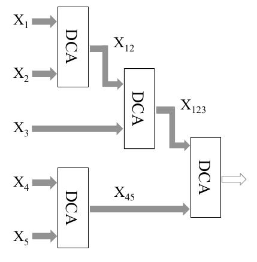

今天的文章是一篇关于feature fusion的文章，文章发表在T-PAMI[^1]上，文章主要结合PCA+CCA或者LDA+CCA的特点，提出DCA.  

The goal of the feature fusion for recognition is to combine relevant information from two or more feature
vectors into a single one, which is expected to be more discriminative than any of the input feature
vectors.

文章指出，用于识别的特征融合目的在于结合来自多个不同模型的特征，使得融合后得到特征较单一输入特征更具有
区分性。而就以往方法而言，CCA可以较好的实现此工作，通过寻找多个模型与融合特征的映射，最终得到最具相关性特征在共享空间内
的特征。而对于特征的融合方式，文章指出有两种：　　

* 拼接(concatenation)
* 相加(summation)  
如下式表示:  
　

$$Z_{1} = \begin{pmatrix} X^{*} \\ Y^{*} \end{pmatrix} =\begin{pmatrix} W_{x}^{T} \\ W_{x}^{T}Y \end{pmatrix}$$   

$$Z_{2} = X^{*} + Y^{*} = W_{x}^T + W_{y}^{*}$$  

### two CCA issues

* CCA不能很好的处理小样本问题：即当样本数量小于特征维度。这样容易造成协方差矩阵奇异或者不可逆。
* CCA-based方法忽略了样本中类的结构，CCA虽然降低了特征之间的关联性，但是对于识别问题，我们对具有类区分性的特征较为感兴趣。

针对第一个问题，有人提出了PCA+CCA的想法，利用PCA降维之后，克服小样本问题；而针对后者，有人利用LDA+CCA获得对识别由于的特征，虽然LDA可以得到区分性较好的
低维特征，但是在CCA处理阶段，此类特征结构容易被破坏，因此此方法不是十分有效。文章基础这两个问题，提出了DCA:不仅可以最大化特征之间的联系，而且可以获得
区分性较好的特征。接下来，我们就简单阐释一下。

### Feature-Level Fusion using Discriminant Correlation Analysis

这里就两类样本做理论介绍，对于样本$$X, Y$$,文章分别做如下类似操作：  

* 首先求得样本协方差$$S_{bx_{p \times p}}=\sum_{i=1}^{c} n_i(\bar{x}_i - \bar{x})(\bar{x}_i - \bar{x}) = \phi_{bx} \phi_{bx}^T$$
* 其次利用协方差$$S_{bx_{p \times p}}$$求得特征向量$$P$$,通过式子$$P^T(\phi^{T}_{bx}\phi_{bx})P = \lambda$$,取其r个主分量为$$Q_{c \times r}$$,
使得$$Q^T(\phi^{T}_{bx}\phi_{bx})Q = \lambda$$,经过变换可以得到$$S_{bx}$$的特征向量：$$(\phi_{bx}Q)^{T}S_{bx}(\phi_{bx}Q) = \lambda_{r \times r}$$,
因此得到变换使得$$W^{T}_{bx}S_{bx}W_{bx} = I$$，因此原样本$$X_{r\times n}^{'} = W^{T}_{bx_{r \times p}}X_{p \times n}$$,同理可以得到样本$$Y$$的变换矩阵。
* 在得到$$X^{'}, Y^{'}$$之后，可以得到$$S_{xy_{r \times r}}^{'}$$, 对齐进行SVD分解，并得到$$(U\sigma^{-1/2})^TS^{'}_{xy}(V\sigma^{-1/2}) = I$$
* 令$$W_{cx} = U\sigma^{-1/2}$$, $$W_{bx} = \phi_{bx}Q\lambda^{-1/2}$$, 可以得到融合空间内特征$$X^{'} = W_{cx}^{T}W_{bx}^{T}X$$

算法过程大致如上述所述，代码在[这里](https://github.com/saicoco/_practice/tree/master/DCA_Fusion)，而当遇到多个模型时，则利用维度关系，优先对较大维度
模型进行DCA处理，向小维度靠近，如下图所示：　　

  
在每一步中，两个最高秩的特征集合将被融合，如在第一步中，$$X_1, X_2$$具有最高的秩，他俩将与下一个最高秩的特征集融合如$$X_3$$,以此类推。

### 小结
文章利用降维和相关性同时处理的思想，提出了DCA,缺点在于手工设计特征，具有较大的人为性。ps:文章有些迷糊，有待深入阅读。

### Reference
----
[^1]: Haghighat M, Abdel-Mottaleb M, Alhalabi W. Discriminant Correlation Analysis: Real-Time Feature Level Fusion for Multimodal Biometric Recognition[J].IEEE Transactions on Information Forensics & Security, 2016, 11(9):1984-1996.
