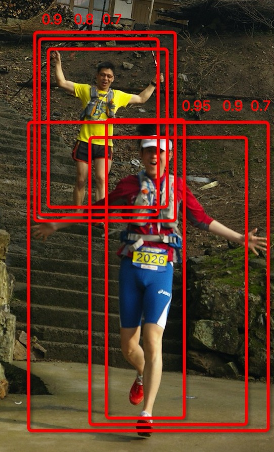

今天开始私下里偷偷学习目标检测,当然先从[fast-rcnn](https://github.com/rbgirshick/fast-rcnn)入手了, 在看论文的过程中发现了非极大值抑制(NMS)
算法，理清思路，这里做一下笔记，以防忘记。

### Non-maximum suppression(非极大值抑制)

先上代码：  

```python

import numpy as np

def nms(dets, thresh):
    x1 = dets[:, 0]
    y1 = dets[:, 1]
    x2 = dets[:, 2]
    y2 = dets[:, 3]
    scores = dets[:, 4]

    areas = (x2 - x1 + 1) * (y2 - y1 + 1)
    order = scores.argsort()[::-1]

    keep = []
    while order.size > 0:
        i = order[0]
        keep.append(i)
        xx1 = np.maximum(x1[i], x1[order[1:]])
        yy1 = np.maximum(y1[i], y1[order[1:]])
        xx2 = np.minimum(x2[i], x2[order[1:]])
        yy2 = np.minimum(y2[i], y2[order[1:]])

        w = np.maximum(0.0, xx2 - xx1 + 1)
        h = np.maximum(0.0, yy2 - yy1 + 1)
        inter = w * h
        ovr = inter / (areas[i] + areas[order[1:]] - inter)

        inds = np.where(ovr <= thresh)[0]
        order = order[inds + 1]

    return keep

```
代码来源于RBG大神源码，几处细节需要详细记录：

1. `np.argsort()`方法默认为升序，如下栗子表示：　　


```python
In [13]: a = np.array([2, 1, 9, 6, 0])
In [14]: a.argsort()
Out[14]: array([4, 1, 0, 3, 2])
```  
2. `np.maximum(arr1, arr2)`的作用为比较`arr1`,`arr2`中元素，返回值为对应元素比较之后保留最大值，上栗子：　　


```python
In [10]: np.maximum(2, [1, 4, 5])
Out[10]: array([2, 4, 5])

In [11]: np.maximum(6, [1, 4, 5])
Out[11]: array([6, 6, 6])
```

在得到boundingbox时，利用评分降序得到boundingbox的优先度，算法每次保留最大评分box，然后寻找与之覆盖区域小于阈值的box，进而去掉重复的box,
在寻找矩阵最大左上角坐标和最小右下角坐标时，利用`np.maximun()`的特性，如上例，1,4,5会被6代替，进而避免与别的窗口的对比。在计算覆盖区域面积时，
同样的，使得面积不会存在小于０的情况，最后保留覆盖区域较小的box.(ps:没能理解indx+1时啥意思)  
如下图:  
  


一共有6个识别为人的框，每一个框有一个置信率，现在需要消除多余的框：　　

* 按置信率排序：0.95, 0.9, 0.9, 0.8, 0.7, 0.7
* 取最大0.95的框为一个物体框
* 剩余5个框中，去掉与0.95框重叠率大于0.6的框，则保留0.9, 0.8, 0.7三个框
* 重复上面三个步骤，　知道没有框了，0.9为一个框
* 选出来的为0.95, 0.9
