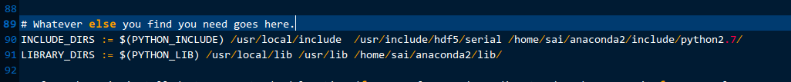
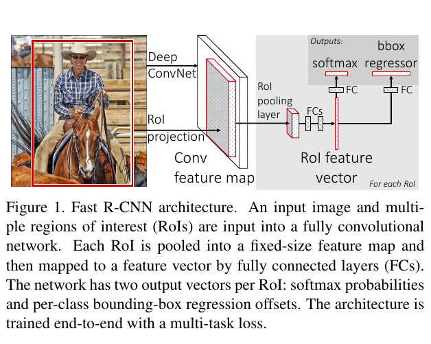
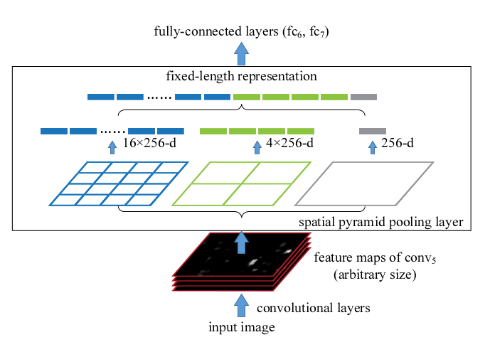
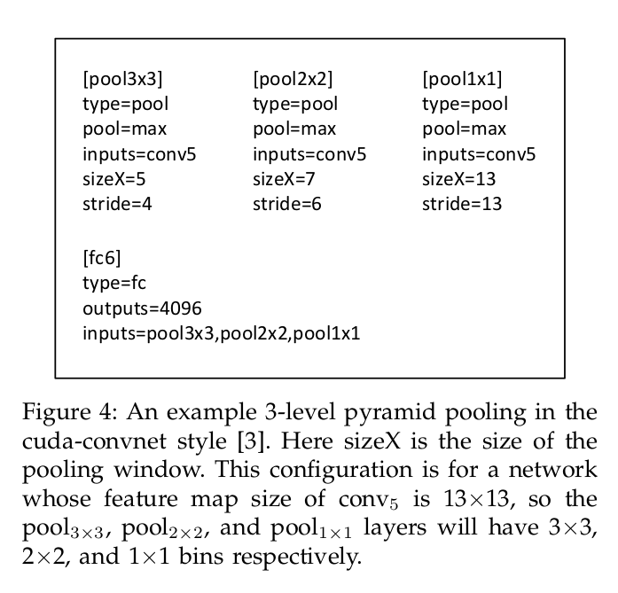

### 配置小插曲

在运行Fast 和　Faster时，总会配置caffe，总会遇到各种问题，今天突然发现一类问题的解决方法。　　

* cannot find XXX.h
* cannot find lXXX.so
以上两种情况分别为找不到头文件和共享链接库，怎么办呢？可以在Makefile.config中找到解决办法，如下图所示:


就是这两行，在编译时找不到头文件或库文件时，可以利用`locate XXX.h`或是`locate libXXX.so`找到其所在路径，然后将其所在目录加入到`INCLUDE_DIRS`和`LIBRARY_DIRS`中，
值得一提的时，Python库使用anaconda是极好的，因为它包含了大多数我们需要的库文件和头文件。以上就可以解决此类问题，可以避免各种系统环境变量配置的操作。当然也会遇到各种“未引用”
的问题，我猜应该是库的版本不对应问题，升级到对应版本即可，此处注意的一般是opencv的问题，还是下源码编译就好，行了，开始正题。

## Fast-RCNN  

还是这篇文章[fast-rcnn](https://github.com/rbgirshick/fast-rcnn)[^1]，最近一直在看代码，仔仔细细从头屡屡，对于RCNN暂时放一放。
Fast-RCNN之所以称为Fast,较RCNN快在proposals获取:RCNN将一张图上的所有proposals都输入到CNN中，而Fast-RCNN利用卷积的平移不变形，一次性将所有的proposals投影到卷积后的feature maps上，
极大的减少了运算量；其次则是端到端的训练，不像以前的模型：Selective search+Hog+SVM, SS+CNN+SVM这种分阶段训练手法，使得模型学习到的特征更为有效。

### Fast-RCNN 原理

上图　　

　　

就上图开讲吧，Fast-RCNN可以分为这么几个模块：

* roi_data_layer
* Deep ConvNet
* roi_pooling_layer
* softmax & box regressor

roi_data_layer主要负责分别向Deep ConvNet和roi_pooling_layer提供整张图片和图片中proposals, labels等，
而Deep ConvNet则从一张图片中提取feature maps, 利用得到的feature maps, roi_data_layer将图片中
proposals投影到其对应feature maps上，然后利用roi_pooling_layer将ROI采样得到固定长度特征向量(ROI feature vector),
然后送入最后的softmax和bbox regressor。这里主要详细讲讲roi_data_layer和roi_pooling_layer

### roi_pooling_layer

roi_pooling的作用是，将形状不一的propoasals通过maxpooling得到固定大小的maps,其思想来源于SPP-Net[^2],不同之处在于，SPP-Net是多层
池化，roi_pooling是单层。如下图所示：　　

  

为了将卷积层最后一层输出与全连接层匹配，利用SPP生成多个指定池化maps,使得对于不定尺寸的图片不需要经过放缩等操作即可输入到网络中。计算方法如下：　　　

　　

如上图，对于MxM的feature maps，预得到poolNxN,则需要计算滑动窗口大小和步长，通过步长预先计算，实现对任意pool结果的实现，此处滑动窗口`win_size = ceil(M/N), stride = floor(M/N)`
有了合适的win_size和stride,便可实现图片不定大小的输入。　　

对于roi_pooling,也是如此，输入为不定大小的proposals,整个训练过程为end-to-end,因此需要SPP一样的层来实现这样的功能:对于不定大小的proposals,可以映射到固定大小的maps。下面就结合代码
分析一下roi_pooling到底干了些什么：　　

```c++


#include <cfloat>

#include "caffe/fast_rcnn_layers.hpp"

using std::max;
using std::min;
using std::floor;
using std::ceil;

namespace caffe {

template <typename Dtype>
void ROIPoolingLayer<Dtype>::LayerSetUp(const vector<Blob<Dtype>*>& bottom,
      const vector<Blob<Dtype>*>& top) {
  ROIPoolingParameter roi_pool_param = this->layer_param_.roi_pooling_param();
  CHECK_GT(roi_pool_param.pooled_h(), 0)
      << "pooled_h must be > 0";
  CHECK_GT(roi_pool_param.pooled_w(), 0)
      << "pooled_w must be > 0";
  pooled_height_ = roi_pool_param.pooled_h();　// 池化后得到maps宽和长度
  pooled_width_ = roi_pool_param.pooled_w();
  spatial_scale_ = roi_pool_param.spatial_scale(); // 此处spatial_scale_为原始图片与卷积层feature maps长度or宽度之比，用来实现投影。
  LOG(INFO) << "Spatial scale: " << spatial_scale_;
}

template <typename Dtype>
void ROIPoolingLayer<Dtype>::Reshape(const vector<Blob<Dtype>*>& bottom,
      const vector<Blob<Dtype>*>& top) {
  // bottom[0]是feature maps, bottom[1]是feature maps上的proposals
  // max_idx_是blob数量的最大值
  channels_ = bottom[0]->channels();
  height_ = bottom[0]->height();
  width_ = bottom[0]->width();
  top[0]->Reshape(bottom[1]->num(), channels_, pooled_height_,
      pooled_width_);
  max_idx_.Reshape(bottom[1]->num(), channels_, pooled_height_,
      pooled_width_);
}

template <typename Dtype>
void ROIPoolingLayer<Dtype>::Forward_cpu(const vector<Blob<Dtype>*>& bottom,
      const vector<Blob<Dtype>*>& top) {
  const Dtype* bottom_data = bottom[0]->cpu_data(); // 获取bottom在内存中的地址
  const Dtype* bottom_rois = bottom[1]->cpu_data();
  // Number of ROIs
  int num_rois = bottom[1]->num();
  int batch_size = bottom[0]->num();
  int top_count = top[0]->count();
  Dtype* top_data = top[0]->mutable_cpu_data();
  caffe_set(top_count, Dtype(-FLT_MAX), top_data);
  int* argmax_data = max_idx_.mutable_cpu_data();
  caffe_set(top_count, -1, argmax_data);

  // For each ROI R = [batch_index x1 y1 x2 y2]: max pool over R
  for (int n = 0; n < num_rois; ++n) {
    // 对于每一个roi_proposal进行投影，利用长度比例将原始图片中proposals一次性放缩至卷积层最后一层feature maps，
    // 这是相对于RCNN的改进之处。bottom_rois中存放每个roi的左上右下坐标。
    int roi_batch_ind = bottom_rois[0];
    int roi_start_w = round(bottom_rois[1] * spatial_scale_);
    int roi_start_h = round(bottom_rois[2] * spatial_scale_);
    int roi_end_w = round(bottom_rois[3] * spatial_scale_);
    int roi_end_h = round(bottom_rois[4] * spatial_scale_);
    CHECK_GE(roi_batch_ind, 0);
    CHECK_LT(roi_batch_ind, batch_size);

    // 计算每个roi的长宽，用来放缩时使用
    int roi_height = max(roi_end_h - roi_start_h + 1, 1);
    int roi_width = max(roi_end_w - roi_start_w + 1, 1);

    // 通过计算roi与pooled_result之间的比例，可以实现feature maps上rois到pooled_result的投影。
    const Dtype bin_size_h = static_cast<Dtype>(roi_height)
                             / static_cast<Dtype>(pooled_height_);
    const Dtype bin_size_w = static_cast<Dtype>(roi_width)
                             / static_cast<Dtype>(pooled_width_);

    const Dtype* batch_data = bottom_data + bottom[0]->offset(roi_batch_ind);

    for (int c = 0; c < channels_; ++c) {
      for (int ph = 0; ph < pooled_height_; ++ph) {
        for (int pw = 0; pw < pooled_width_; ++pw) {
          // Compute pooling region for this output unit:
          //  start (included) = floor(ph * roi_height / pooled_height_)
          //  end (excluded) = ceil((ph + 1) * roi_height / pooled_height_)

          // 利用比例关系，得到maxpool中每个位置对应feature maps的位置区域，而这是相对于0开始的，因此
          // 需要加上roi的起始坐标
          int hstart = static_cast<int>(floor(static_cast<Dtype>(ph)
                                              * bin_size_h));
          int wstart = static_cast<int>(floor(static_cast<Dtype>(pw)
                                              * bin_size_w));
          int hend = static_cast<int>(ceil(static_cast<Dtype>(ph + 1)
                                           * bin_size_h));
          int wend = static_cast<int>(ceil(static_cast<Dtype>(pw + 1)
                                           * bin_size_w));

          hstart = min(max(hstart + roi_start_h, 0), height_);
          hend = min(max(hend + roi_start_h, 0), height_);
          wstart = min(max(wstart + roi_start_w, 0), width_);
          wend = min(max(wend + roi_start_w, 0), width_);

          bool is_empty = (hend <= hstart) || (wend <= wstart);

          const int pool_index = ph * pooled_width_ + pw;
          if (is_empty) {
            top_data[pool_index] = 0;
            argmax_data[pool_index] = -1;
          }

          // 对每个区域进行maxpooling
          for (int h = hstart; h < hend; ++h) {
            for (int w = wstart; w < wend; ++w) {
              const int index = h * width_ + w;
              if (batch_data[index] > top_data[pool_index]) {
                top_data[pool_index] = batch_data[index];
                argmax_data[pool_index] = index;
              }
            }
          }
        }
      }
      // Increment all data pointers by one channel
      batch_data += bottom[0]->offset(0, 1);
      top_data += top[0]->offset(0, 1);
      argmax_data += max_idx_.offset(0, 1);
    }
    // Increment ROI data pointer
    bottom_rois += bottom[1]->offset(1);
  }
}

template <typename Dtype>
void ROIPoolingLayer<Dtype>::Backward_cpu(const vector<Blob<Dtype>*>& top,
      const vector<bool>& propagate_down, const vector<Blob<Dtype>*>& bottom) {
  NOT_IMPLEMENTED;
}


#ifdef CPU_ONLY
STUB_GPU(ROIPoolingLayer);
#endif

INSTANTIATE_CLASS(ROIPoolingLayer);
REGISTER_LAYER_CLASS(ROIPooling);

}  // namespace caffe

```  


以上便是roi_pooling_layer的源码解析，够看。

### roi_data_layer

该层主要还是利用SS方法获取proposals并且送入到网络，厉害之处是将一个分阶段的工作与网络成为一体，后续将详细讲解caffe中python_layer的使用，这里先挖个坑，这是一类问题。这里主要讲解
该层的主要功能。Talk cheat, show you code.  


```   

    def setup(self, bottom, top):
        layer_params = yaml.load(self.param_str_)

        self._num_classes = layer_params['num_classes']

        self._name_to_top_map = {
            'data': 0,
            'rois': 1,
            'labels': 2}

        # data blob: holds a batch of N images, each with 3 channels
        # The height and width (100 x 100) are dummy values
        top[0].reshape(1, 3, 100, 100)

        # rois blob: holds R regions of interest, each is a 5-tuple
        # (n, x1, y1, x2, y2) specifying an image batch index n and a
        # rectangle (x1, y1, x2, y2)
        top[1].reshape(1, 5)

        # labels blob: R categorical labels in [0, ..., K] for K foreground
        # classes plus background
        top[2].reshape(1)

        if cfg.TRAIN.BBOX_REG:
            self._name_to_top_map['bbox_targets'] = 3
            self._name_to_top_map['bbox_loss_weights'] = 4

            # bbox_targets blob: R bounding-box regression targets with 4
            # targets per class
            top[3].reshape(1, self._num_classes * 4)

            # bbox_loss_weights blob: At most 4 targets per roi are active;
            # thisbinary vector sepcifies the subset of active targets
            top[4].reshape(1, self._num_classes * 4)
```　　


作为网络的第一层，roi_data_layer向网络中提供了`data`, `rois`, `labels`三种数据，`data`为整张图片，`rois`为通过selective search方法得到的rois，然后根据overlap判断目标还是背景，得到标签，并且获得一定数量的proposals, `labels`为rois对应为背景还是目标，可以看出，在输入网络前，这些数据是
处理好的，这是与Faster RCNN不同之处，同时也是fast-RCNN的瓶颈。细节可以查看源码。

### Reference

[^1]: Girshick R. Fast R-CNN[J]. Computer Science, 2015.   

[^2]: He K, Zhang X, Ren S, et al. Spatial Pyramid Pooling in Deep Convolutional Networks for Visual Recognition[J].
