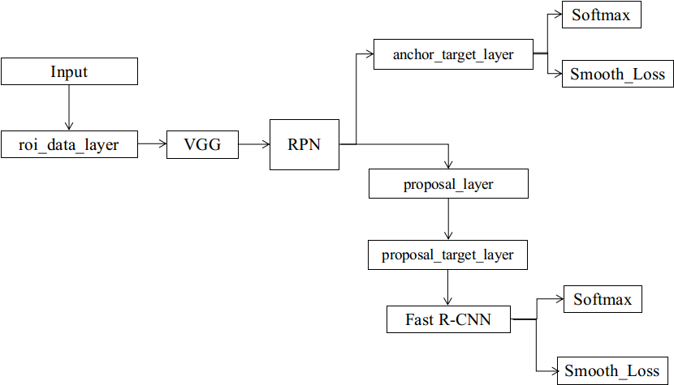

### 写在前面的话

这篇文章主要讲述Faster RCNN[^1]目标识别框架，不得不说，代码写得真心不错，调调就可以跑。是在周董《Now you see me》看的代码，感觉周董很nice,音乐也很带感。
---Now you see me cuz I let it be!

## Faster RCNN  
Faster RCNN较Fast RCNN的优势之处在于对rois的选取，主要模块可以看做三大块，roi_data, VGG, RPN, RCNN，这里主要就以下几个模块着重讲解:  

* roi_data_layer
* anchor_target_layer
* proposal_layer
* proposal_target_layer
* roi_pooling_layer　　

整体流程图可以如下图所示：　　

  


其中roi_pooling_layer已经在fast-RCNN中讲解，因此这里讲述剩余层的功能以及整个算法流程。

### roi_data_layer  

roi_data_layer在Fast－RCNN中主要提供`data`, `rois`, `labels`，而在Faster-RCNN中，它只提供`data`, `im_info`, `gt_boxes`。roi_data_layer不再提供rois,除非在不使用RPN的情况下，
只是给出了图片的信息`im_info`:(width, height, scale), 目标位置`gt_boxes`:(x1, y1, x2, y2, cls)，图片数据`data`,其余rois的获取交给了RPN_layer来完成。　　　


### anchor_target_layer  

该层输入为`rpn_cls_score`, `gt_boxes`, `im_info`, `data`, 其中`rpn_cls_score`为RPN的输出，是对每个来自VGG的conv5_4的feature maps
的响应。该层的作用是实现**selective search**的功能，对于来自`data`中的图片及其对应的`gt_boxes`,计算出所有的rois.   

#### generate anchors  
拿代码来说　　

```python
import numpy as np
def generate_anchors(base_size=16, ratios=[0.5, 1, 2],
                     scales=2**np.arange(3, 6)):
    """
    Generate anchor (reference) windows by enumerating aspect ratios X
    scales wrt a reference (0, 0, 15, 15) window.
    """
    # 这里选取16的原因在于，原始图像224x224,conv5卷积层输出feature maps大小为14x14,是16的缩放关系。对于
    # feature maps上的每个点，在width方向最大偏移为14,同理在height上也是14.
    # 在图像左上角生成一个anchors,剩下的anchors在此基础上做偏移即可得到。
    # scales=[8, 16, 32],
    base_anchor = np.array([1, 1, base_size, base_size]) - 1
    ratio_anchors = _ratio_enum(base_anchor, ratios)
    anchors = np.vstack([_scale_enum(ratio_anchors[i, :], scales)
                         for i in xrange(ratio_anchors.shape[0])])
    return anchors

def _whctrs(anchor):
    """
    Return width, height, x center, and y center for an anchor (window).
    """

    w = anchor[2] - anchor[0] + 1
    h = anchor[3] - anchor[1] + 1
    x_ctr = anchor[0] + 0.5 * (w - 1)
    y_ctr = anchor[1] + 0.5 * (h - 1)
    return w, h, x_ctr, y_ctr

def _mkanchors(ws, hs, x_ctr, y_ctr):
    """
    Given a vector of widths (ws) and heights (hs) around a center
    (x_ctr, y_ctr), output a set of anchors (windows).
    """
    # 对于给定anchor中心坐标和长宽，生成三个anchors,分别时1:0.5, 1:1, 1:2
    ws = ws[:, np.newaxis]
    hs = hs[:, np.newaxis]
    anchors = np.hstack((x_ctr - 0.5 * (ws - 1),
                         y_ctr - 0.5 * (hs - 1),
                         x_ctr + 0.5 * (ws - 1),
                         y_ctr + 0.5 * (hs - 1)))
    return anchors

def _ratio_enum(anchor, ratios):
    """
    Enumerate a set of anchors for each aspect ratio wrt an anchor.
    """

    w, h, x_ctr, y_ctr = _whctrs(anchor)
    size = w * h
    size_ratios = size / ratios
    ws = np.round(np.sqrt(size_ratios))
    hs = np.round(ws * ratios)
    anchors = _mkanchors(ws, hs, x_ctr, y_ctr)
    return anchors

def _scale_enum(anchor, scales):
    """
    Enumerate a set of anchors for each scale wrt an anchor.
    """
    # 对于每一个scale,生成三个anchors，总共可以生成9个anchors
    w, h, x_ctr, y_ctr = _whctrs(anchor)
    ws = w * scales
    hs = h * scales
    anchors = _mkanchors(ws, hs, x_ctr, y_ctr)
    return anchors
```

#### anchor_target　　

`bottom`值得注意的是`rpn_cls_score`,开始我以为会用到，在阅读代码之后，可以知道它的作用仅仅是为得到feature maps的width,height,用作anchors的生成。在获取anchors之后，
可以利用其计算与`gt_boxes`的overlap值，以此来获得目标还是背景的标签。(ps;这里贴代码时候需要四个空格才给算，也是醉了)上源码：　　

```python

    class AnchorTargetLayer(caffe.Layer):

    def setup(self, bottom, top):
        layer_params = yaml.load(self.param_str_)
        anchor_scales = layer_params.get('scales', (8, 16, 32))
        # generate 1:0.5, 1:1, 1:2 anchors,利用上述生成anchors方法。
        self._anchors = generate_anchors(scales=np.array(anchor_scales))
        self._num_anchors = self._anchors.shape[0]
        self._feat_stride = layer_params['feat_stride']

        if DEBUG:
            print 'anchors:'
            print self._anchors
            print 'anchor shapes:'
            print np.hstack((
                self._anchors[:, 2::4] - self._anchors[:, 0::4],
                self._anchors[:, 3::4] - self._anchors[:, 1::4],
            ))
            self._counts = cfg.EPS
            self._sums = np.zeros((1, 4))
            self._squared_sums = np.zeros((1, 4))
            self._fg_sum = 0
            self._bg_sum = 0
            self._count = 0

        # allow boxes to sit over the edge by a small amount
        self._allowed_border = layer_params.get('allowed_border', 0)

        height, width = bottom[0].data.shape[-2:]
        if DEBUG:
            print 'AnchorTargetLayer: height', height, 'width', width

        A = self._num_anchors
        # labels
        top[0].reshape(1, 1, A * height, width)
        # bbox_targets
        top[1].reshape(1, A * 4, height, width)
        # bbox_inside_weights
        top[2].reshape(1, A * 4, height, width)
        # bbox_outside_weights
        top[3].reshape(1, A * 4, height, width)

    def forward(self, bottom, top):
        # Algorithm:
        #
        # for each (H, W) location i
        #   generate 9 anchor boxes centered on cell i
        #   apply predicted bbox deltas at cell i to each of the 9 anchors
        # filter out-of-image anchors
        # measure GT overlap

        assert bottom[0].data.shape[0] == 1, \
            'Only single item batches are supported'

        # map of shape (..., H, W)
        # 利用rpn_cls_score来获得feature_maps的长宽
        height, width = bottom[0].data.shape[-2:]
        # GT boxes (x1, y1, x2, y2, label)
        gt_boxes = bottom[1].data
        # im_info
        im_info = bottom[2].data[0, :]

        if DEBUG:
            print ''
            print 'im_size: ({}, {})'.format(im_info[0], im_info[1])
            print 'scale: {}'.format(im_info[2])
            print 'height, width: ({}, {})'.format(height, width)
            print 'rpn: gt_boxes.shape', gt_boxes.shape
            print 'rpn: gt_boxes', gt_boxes

        # 1. Generate proposals from bbox deltas and shifted anchors
        # 利用获得每个anchor相对于图片左上角的anchor的移动步长。
        shift_x = np.arange(0, width) * self._feat_stride
        shift_y = np.arange(0, height) * self._feat_stride
        shift_x, shift_y = np.meshgrid(shift_x, shift_y)
        shifts = np.vstack((shift_x.ravel(), shift_y.ravel(),
                            shift_x.ravel(), shift_y.ravel())).transpose()
        # add A anchors (1, A, 4) to
        # cell K shifts (K, 1, 4) to get
        # shift anchors (K, A, 4)
        # reshape to (K*A, 4) shifted anchors
        A = self._num_anchors
        K = shifts.shape[0]
        # each anchor add with all shifts to get all anchors
        all_anchors = (self._anchors.reshape((1, A, 4)) +
                       shifts.reshape((1, K, 4)).transpose((1, 0, 2)))
        all_anchors = all_anchors.reshape((K * A, 4))
        total_anchors = int(K * A)

        # only keep anchors inside the image
        # 丢弃所有超过边界的anchors,即使是一点点。
        inds_inside = np.where(
            (all_anchors[:, 0] >= -self._allowed_border) &
            (all_anchors[:, 1] >= -self._allowed_border) &
            (all_anchors[:, 2] < im_info[1] + self._allowed_border) &  # width
            (all_anchors[:, 3] < im_info[0] + self._allowed_border)    # height
        )[0]

        if DEBUG:
            print 'total_anchors', total_anchors
            print 'inds_inside', len(inds_inside)

        # keep only inside anchors
        anchors = all_anchors[inds_inside, :]
        if DEBUG:
            print 'anchors.shape', anchors.shape

        # label: 1 is positive, 0 is negative, -1 is dont care
        labels = np.empty((len(inds_inside), ), dtype=np.float32)
        labels.fill(-1)

        # overlaps between the anchors and the gt boxes(x1, y1, x2, y2, cls)
        # overlaps (ex, gt)

        # 计算anchors与gt_boxes的overlap
        overlaps = bbox_overlaps(
            np.ascontiguousarray(anchors, dtype=np.float),
            np.ascontiguousarray(gt_boxes, dtype=np.float))
        # 获取每行最大overlap
        argmax_overlaps = overlaps.argmax(axis=1)
        max_overlaps = overlaps[np.arange(len(inds_inside)), argmax_overlaps]
        gt_argmax_overlaps = overlaps.argmax(axis=0)
        # 获取每列最大的overlap, 这里疑问，每列每行各代表啥。
        gt_max_overlaps = overlaps[gt_argmax_overlaps,
                                   np.arange(overlaps.shape[1])]
        gt_argmax_overlaps = np.where(overlaps == gt_max_overlaps)[0]

        if not cfg.TRAIN.RPN_CLOBBER_POSITIVES:
            # assign bg labels first so that positive labels can clobber them
            labels[max_overlaps < cfg.TRAIN.RPN_NEGATIVE_OVERLAP] = 0

        # fg label: for each gt, anchor with highest overlap
        # 无论如何，最大的overlap对应的是目标
        labels[gt_argmax_overlaps] = 1

        # fg label: above threshold IOU
        labels[max_overlaps >= cfg.TRAIN.RPN_POSITIVE_OVERLAP] = 1

        if cfg.TRAIN.RPN_CLOBBER_POSITIVES:
            # assign bg labels last so that negative labels can clobber positives
            labels[max_overlaps < cfg.TRAIN.RPN_NEGATIVE_OVERLAP] = 0

        # subsample positive labels if we have too many
        num_fg = int(cfg.TRAIN.RPN_FG_FRACTION * cfg.TRAIN.RPN_BATCHSIZE)
        fg_inds = np.where(labels == 1)[0]
        if len(fg_inds) > num_fg:
            disable_inds = npr.choice(
                fg_inds, size=(len(fg_inds) - num_fg), replace=False)
            labels[disable_inds] = -1

        # subsample negative labels if we have too many
        num_bg = cfg.TRAIN.RPN_BATCHSIZE - np.sum(labels == 1)
        bg_inds = np.where(labels == 0)[0]
        if len(bg_inds) > num_bg:
            disable_inds = npr.choice(
                bg_inds, size=(len(bg_inds) - num_bg), replace=False)
            labels[disable_inds] = -1
            #print "was %s inds, disabling %s, now %s inds" % (
                #len(bg_inds), len(disable_inds), np.sum(labels == 0))

        bbox_targets = np.zeros((len(inds_inside), 4), dtype=np.float32)
        # transform anchors 's coordinate to [0, 1]
        bbox_targets = _compute_targets(anchors, gt_boxes[argmax_overlaps, :])
        # inside and outside means that anchors in geboxes or out of gtboxes.
        bbox_inside_weights = np.zeros((len(inds_inside), 4), dtype=np.float32)
        bbox_inside_weights[labels == 1, :] = np.array(cfg.TRAIN.RPN_BBOX_INSIDE_WEIGHTS)

        bbox_outside_weights = np.zeros((len(inds_inside), 4), dtype=np.float32)
        if cfg.TRAIN.RPN_POSITIVE_WEIGHT < 0:
            # uniform weighting of examples (given non-uniform sampling)
            num_examples = np.sum(labels >= 0)
            positive_weights = np.ones((1, 4)) * 1.0 / num_examples
            negative_weights = np.ones((1, 4)) * 1.0 / num_examples
        else:
            assert ((cfg.TRAIN.RPN_POSITIVE_WEIGHT > 0) &
                    (cfg.TRAIN.RPN_POSITIVE_WEIGHT < 1))
            positive_weights = (cfg.TRAIN.RPN_POSITIVE_WEIGHT /
                                np.sum(labels == 1))
            negative_weights = ((1.0 - cfg.TRAIN.RPN_POSITIVE_WEIGHT) /
                                np.sum(labels == 0))
        bbox_outside_weights[labels == 1, :] = positive_weights
        bbox_outside_weights[labels == 0, :] = negative_weights

        if DEBUG:
            self._sums += bbox_targets[labels == 1, :].sum(axis=0)
            self._squared_sums += (bbox_targets[labels == 1, :] ** 2).sum(axis=0)
            self._counts += np.sum(labels == 1)
            means = self._sums / self._counts
            stds = np.sqrt(self._squared_sums / self._counts - means ** 2)
            print 'means:'
            print means
            print 'stdevs:'
            print stds

        # map up to original set of anchors
        labels = _unmap(labels, total_anchors, inds_inside, fill=-1)
        bbox_targets = _unmap(bbox_targets, total_anchors, inds_inside, fill=0)
        bbox_inside_weights = _unmap(bbox_inside_weights, total_anchors, inds_inside, fill=0)
        bbox_outside_weights = _unmap(bbox_outside_weights, total_anchors, inds_inside, fill=0)

        if DEBUG:
            print 'rpn: max max_overlap', np.max(max_overlaps)
            print 'rpn: num_positive', np.sum(labels == 1)
            print 'rpn: num_negative', np.sum(labels == 0)
            self._fg_sum += np.sum(labels == 1)
            self._bg_sum += np.sum(labels == 0)
            self._count += 1
            print 'rpn: num_positive avg', self._fg_sum / self._count
            print 'rpn: num_negative avg', self._bg_sum / self._count

        # labels for each anchors, so shape is (1, 1, A * height, width)
        labels = labels.reshape((1, height, width, A)).transpose(0, 3, 1, 2)
        labels = labels.reshape((1, 1, A * height, width))
        top[0].reshape(*labels.shape)
        top[0].data[...] = labels

        # bbox_targets
        bbox_targets = bbox_targets \
            .reshape((1, height, width, A * 4)).transpose(0, 3, 1, 2)
        top[1].reshape(*bbox_targets.shape)
        top[1].data[...] = bbox_targets

        # bbox_inside_weights
        bbox_inside_weights = bbox_inside_weights \
            .reshape((1, height, width, A * 4)).transpose(0, 3, 1, 2)
        assert bbox_inside_weights.shape[2] == height
        assert bbox_inside_weights.shape[3] == width
        top[2].reshape(*bbox_inside_weights.shape)
        top[2].data[...] = bbox_inside_weights

        # bbox_outside_weights
        bbox_outside_weights = bbox_outside_weights \
            .reshape((1, height, width, A * 4)).transpose(0, 3, 1, 2)
        assert bbox_outside_weights.shape[2] == height
        assert bbox_outside_weights.shape[3] == width
        top[3].reshape(*bbox_outside_weights.shape)
        top[3].data[...] = bbox_outside_weights

    def backward(self, top, propagate_down, bottom):
        """This layer does not propagate gradients."""
        pass

    def reshape(self, bottom, top):
        pass

```　　


以上是anchors_target_layer的全部内容，取巧之处在于利用feature maps与原始图像之间的放缩关系，在原始图像中，一个步长中采用9中anchors([1:0.5, 1:1, 1:2], [128, 256, 512]),
这样生成一张图像上所有的rois。接下来我们就讲讲proposal_layer  


#### proposal_layer  

在RPN的两个输出的基础上，`rpn_bbox_pred`和`rpn_cls_prob`, 该层的作用是利用来自RPN的feature maps生成一系列anchors,然后过滤掉比较小的框，如不尺寸太小的；然后利用非极大值抑制根据RPN的对目标保留较少的框，
并且利用`rpn_cls_prob`将bbox从[0, 1]映射会实际大小，用作proposal_target_layer的输入。而在proposal_target_layer中，则利用上述获得的proposals通过对目标或者背景阈值的判断，生成其标签用作分类，生成其目标
坐标用作回归。这里值得注意的是，`rpn_cls_prob`和`rpn_bbox_pred`都来自于RPN的起始的卷积层，而非`anchor_target_layer`,在观察源码之后，可以发现，其实`anchor_target_layer`和`proposals_target_layer`功能类似，
都是利用生成`anchor`来获得proposals,由此我们也了解了作者分阶段训练的原因。

#### 模型训练　　

作者用4步来训练模型:  

* 利用pre-train模型初始化卷积部分，并对RPN部分进行训练
* 利用上一步训练好的权重初始化网络以及proposal_layer部分，用作训练fast R-CNN部分
* 在上一步训练结束后，RPN和Fast R-CNN并没有实现卷积层的权重共享，因此利用两个网络的损失函数，固定卷积层部分，对RPN层单独进行微调，实现权重共享
* 然后固定卷积层部分，微调Fast R-CNN部分，进而达到两个模型的统一。

#### 心得　　

模型一开始看不懂`anchor_layer`和`proposal_layer`的区别，作者如此设计为的是分阶段训练，最终达到RPN部分得到的
regions可以想selective search一样为网络提供目标区域，进而测试的时候，可以利用`proposal_layer`代替`anchor_layer`产生
proposals,实验仅是看懂，代码还未上手使用，这是个大工程啊。　　

#### Reference

[^1]: Ren S, He K, Girshick R, et al. Faster R-CNN: Towards Real-Time Object Detection with Region Proposal Networks.[J]. IEEE Transactions on Pattern Analysis & Machine Intelligence, 2015:1-1.
