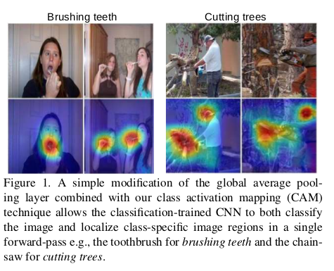
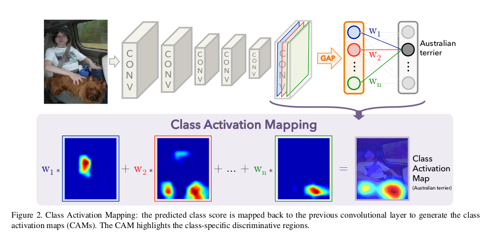
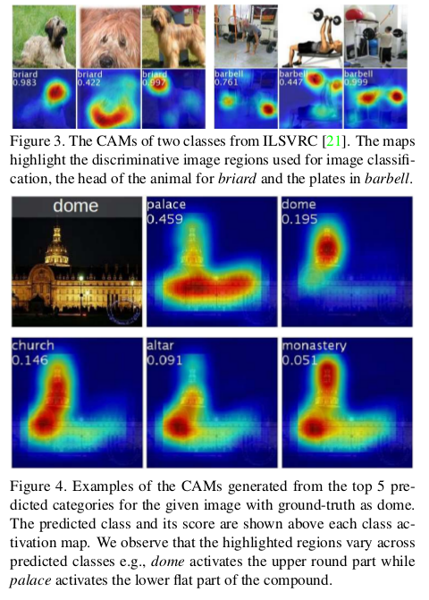
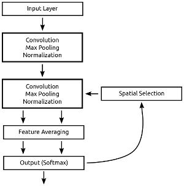
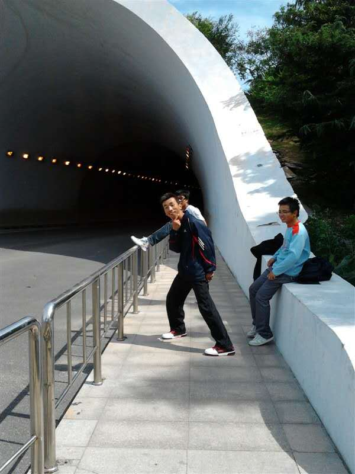
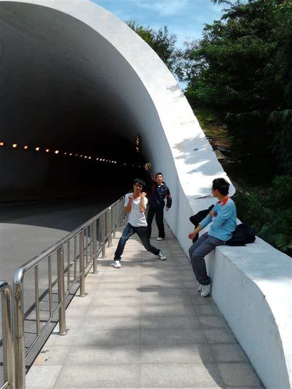

---
layout: post
title: 论文笔记--Learning Deep Features for Discriminative Localization
tag:
- paper
category: paper
comments: true
blog: true
data: 2016-09-28
---  

### 写在前面的话  

从北京回来了，此行给我当头一棒，真大牛真的很厉害，单metric learning可以做的很深很透彻，瞬间感觉自己个太渺小了。但是，活依旧得干！
这回是一篇论文笔记，关于object localization,注意力机制，走起！！  

### Introduction  

CNN一直有这种能力，即使在未给定监督信息，仍可以表现得像一个目标检测器，而这种能力主要体现在convolutional layers,当将这些信息输入
fully-connected layers， 这种能力便丢失了，因此使得网络识别能力下降，最近NIN, GoogLeNet已经提出替换fc layer来减少参数数量进
而提升网络性能。  

文章[^1]使用全局均值池化来避免过拟合，同时作者发现，即使在网络最后一层，仍然保留着明显的定位能力，而这使得作者提出了注意力模型。  
如下图所示  

  

利用注意力机制，网络成功的捕捉到了动作而不是人物本身，接下来，我们就着重 讲解网络的细节。  

### Class Activation Mapping  

文章提出了一种获取注意力的思路，如下图所示：  

  

这里需要结合上图描述，CAM(class actication mapping)是通过GAP(global average pooling)得到的，CAM在feature map中对应的部分
是图片区域中最具有区分性的部分，可以用来很好的区分类别。正如图所示，GAP的输入来自于卷积层的最后一层，而GAP输出的加权和作为最后的输出，
同样的，作者计算最后一层卷积层的feature maps的加权和作为CAP。  

可以这么说，对于一张给定的image，$$f_{k}(x, y)$$表示最后一层卷积层位置$$(x, y)$$处神经元$$k$$的activation，然后神经元$$k$$进行GAP，
得到$$F^{k}=\sum_{x, y}f_{k}(x, y)$$。如此以来，对于给定类别c,Softmax层的输入为$$S_{c} = \sum_{k}w_{k}^{c}F_{k}$$，其中$$w_{k}^{c}$$
是类别c对应的单元k，最终$$w_{k}^{c}$$表示$$F_{k}$$对于类别c的重要性。网络最终输出为softmax的分类概率。
具体化$$S_c$$即$$S_c = \sum_k w_{k}^{c} \sum_{x, y} f_{k}(x, y)$$,换种方式$$S_c = \sum_{x, y}\sum_k w_{k}^{c}f_{k}(x, y)$$，
文章定义$$M_c{x, y} = \sum_k w_{k}^{c}f_{k}(x, y)$$为位置(x, y)处类别c的CAM，这样可以得到$$S_c = \sum_{x, y}M_{c}(x, y)$$，可以看出，
$$M_{c}(x, y)$$直接表示空间位置(x, y)处的activation对于类别c的重要性。  

  

如上图所示，是一些利用CAM得到的结果，可以看出，有一定效果。  

### 代码  

代码框架图：  

  

文章思路可以理解为，利用最后一层卷积层和softmax的分类概率作乘积，即加权和，实现attention。show your code！  

```python

from keras import backend as K
from keras.layers import Input, Dense, merge, Flatten, Dropout, Lambda, normalization, Merge, Reshape, noise
from keras.models import Model
from keras.optimizers import SGD
from keras.layers.convolutional import Convolution2D, MaxPooling2D, ZeroPadding2D
from keras.utils.visualize_util import plot

def crosschannelnormalization(alpha=1e-4, k=2, beta=0.75, n=5, **kwargs):
    """
    This is the function used for cross channel normalization in the original
    Alexnet
    """

    def f(X):
        b, ch, r, c = X.shape
        half = n // 2
        square = K.square(X)
        extra_channels = K.spatial_2d_padding(K.permute_dimensions(square, (0, 2, 3, 1))
                                              , (0, half))
        extra_channels = K.permute_dimensions(extra_channels, (0, 3, 1, 2))
        scale = k
        for i in range(n):
            scale += alpha * extra_channels[:, i:i + ch, :, :]
        scale = scale ** beta
        return X / scale

    return Lambda(f, output_shape=lambda input_shape: input_shape, **kwargs)


def global_average_pooling(x):
    return K.mean(x, axis=(2, 3))


def global_average_pooling_shape(input_shape):
    return input_shape[0:2]


def attention_control(args):
    x, dense_2 = args
    find_att = K.reshape(x, (15, 15, 10))
    find_att = K.transpose(find_att[:, :, :])
    find_att = K.mean(find_att, axis=0)
    find_att = find_att / K.sum(find_att, axis=0)
    find_att = K.repeat_elements(find_att, 32, axis=0)
    find_att = K.reshape(find_att, (1, 32, 15, 15))
    return find_att


def no_attention_control(args):
    x, dense_2 = args
    find_att = K.ones(shape=(1, 32, 15, 15))
    return find_att


def change_shape1(x):
    x = K.reshape(K.transpose(x), (15 * 15, 32))
    return x


def att_shape(input_shape):
    return (input_shape[0][0], 32, 15, 15)


def att_shape2(input_shape):
    return input_shape[0][0:4]


def minst_attention(noise=False, attention=True):
    # make layers
    inputs = Input(shape=(1, image_size, image_size), name='input')

    conv_1a = Convolution2D(32, 3, 3, activation='relu', name='conv_1')
    maxp_1a = MaxPooling2D((3, 3), strides=(2, 2), name='convmax_1')
    norm_1a = crosschannelnormalization(name="convpool_1")
    zero_1a = ZeroPadding2D((2, 2), name='convzero_1')

    conv_2a = Convolution2D(32, 3, 3, activation='relu', name='conv_2')
    maxp_2a = MaxPooling2D((3, 3), strides=(2, 2), name='convmax_2')
    norm_2a = crosschannelnormalization(name="convpool_2")
    zero_2a = ZeroPadding2D((2, 2), name='convzero_2')

    dense_1a = Lambda(global_average_pooling, output_shape=global_average_pooling_shape, name='dense_1')
    dense_2a = Dense(10, activation='softmax', init='uniform', name='dense_2')

    # make actual model
    if noise: inputs = noise.GaussianNoise(2.5)(inputs)
    input_pad = ZeroPadding2D((1, 1), input_shape=(1, image_size, image_size), name='input_pad')(inputs)

    conv_1 = conv_1a(input_pad)
    conv_1 = maxp_1a(conv_1)
    conv_1 = norm_1a(conv_1)
    conv_1 = zero_1a(conv_1)

    conv_2_x = conv_2a(conv_1)
    conv_2 = maxp_2a(conv_2_x)
    conv_2 = norm_2a(conv_2)
    conv_2 = zero_2a(conv_2)
    conv_2 = Dropout(0.5)(conv_2)

    dense_1 = dense_1a(conv_2)
    dense_2 = dense_2a(dense_1)

    conv_shape1 = Lambda(change_shape1, output_shape=(32,), name='chg_shape')(conv_2_x)
    find_att = dense_2a(conv_shape1)

    if attention:
        find_att = Lambda(attention_control, output_shape=att_shape, name='att_con')([find_att, dense_2])
    else:
        find_att = Lambda(no_attention_control, output_shape=att_shape, name='att_con')([find_att, dense_2])

    zero_3a = ZeroPadding2D((1, 1), name='convzero_3')(find_att)
    apply_attention = Merge(mode='mul', name='attend')([zero_3a, conv_1])

    conv_3 = conv_2a(apply_attention)
    conv_3 = maxp_2a(conv_3)
    conv_3 = norm_2a(conv_3)
    conv_3 = zero_2a(conv_3)

    dense_3 = dense_1a(conv_3)
    dense_4 = dense_2a(dense_3)

    model = Model(input=inputs, output=dense_4)

    return model


import numpy as np
from keras.datasets import mnist
import cPickle as pickle
(X_train, y_train), (X_test, y_test) = mnist.load_data()
image_size = np.shape(X_train[0])[1]
X_train.shape = (len(X_train), 1, image_size, image_size)
X_test.shape = (len(X_test), 1, image_size, image_size)

from keras.utils.np_utils import to_categorical

y_trainCAT = to_categorical(y_train)
y_testCAT = to_categorical(y_test)

model = minst_attention()
sgd = SGD(lr=0.01, decay=1e-6, momentum=0.5, nesterov=True)
model.compile(loss='categorical_crossentropy', optimizer=sgd, metrics=['accuracy'])

# plot(model, to_file='model.png')
model_history = model.fit(X_train, y_trainCAT, batch_size=1, validation_data=(X_test, y_testCAT), nb_epoch=12, verbose=1)
pickle.dump(model_history.history['val_acc'], open("./Performance/minst_onesatt2_noise_performance.p", "wb"))
score = model_history.history['val_acc'][-1]
all_score = model_history.history['val_acc']

```   


代码的巧妙之处在于利用`Lambda`实现自定义层，如`crosschannelnormalization`, `global_average_pooling`, `attention_control`等自定义操作，而文章
创新点在于利用第一次`dense_2a`得到的prob与conv进行`mul`操作，然后将结果输入至后续卷积层，即首先利用attention获取有用的region，然后将region用于分类，
可以极大的避免无用region对分类结果的影响。

### 唠叨几句  

从北京回来发现自己不像以前爱嬉皮笑脸，不知道是不是一件好事，今天突然看到舍友发的我大一时候的照片，感触颇深啊，那会着装，动作。。。回不去了～那会怎么那么年轻。Too simple 啊！！上图。  


  
  


### Reference  

[^1] http://cnnlocalization.csail.mit.edu/
