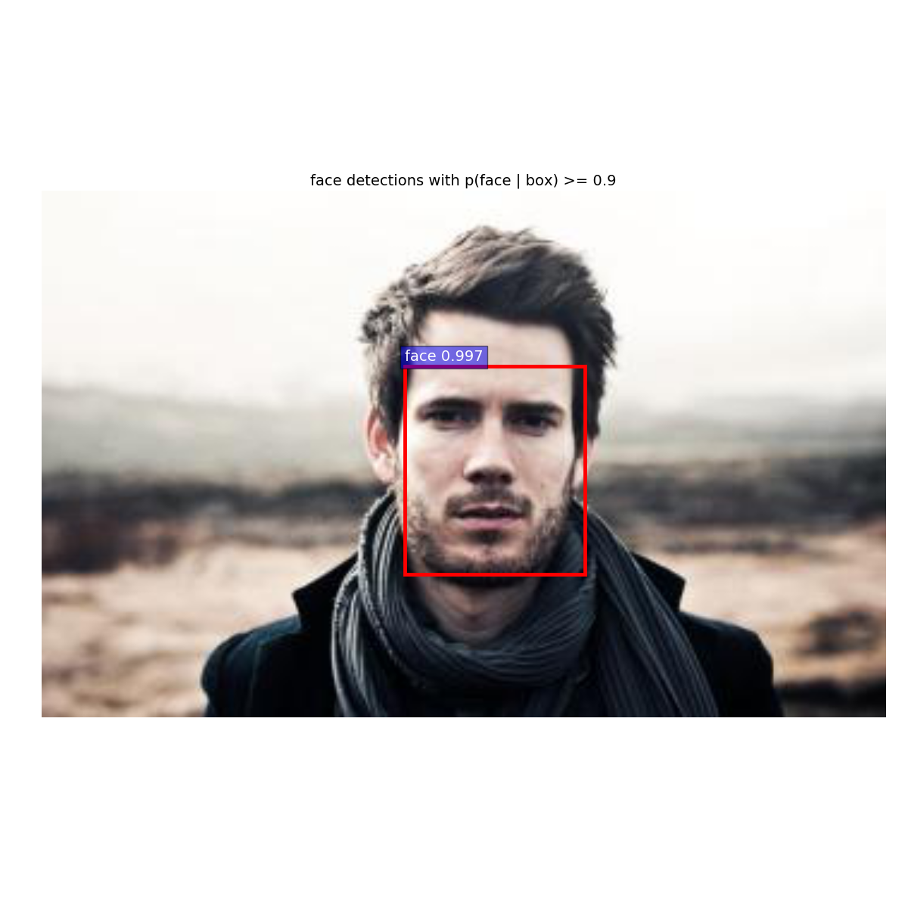
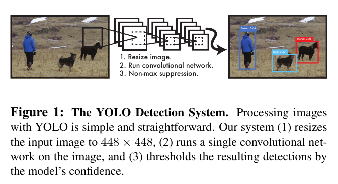
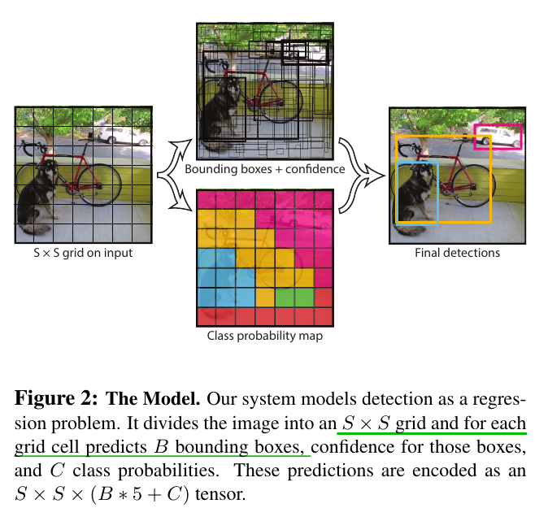
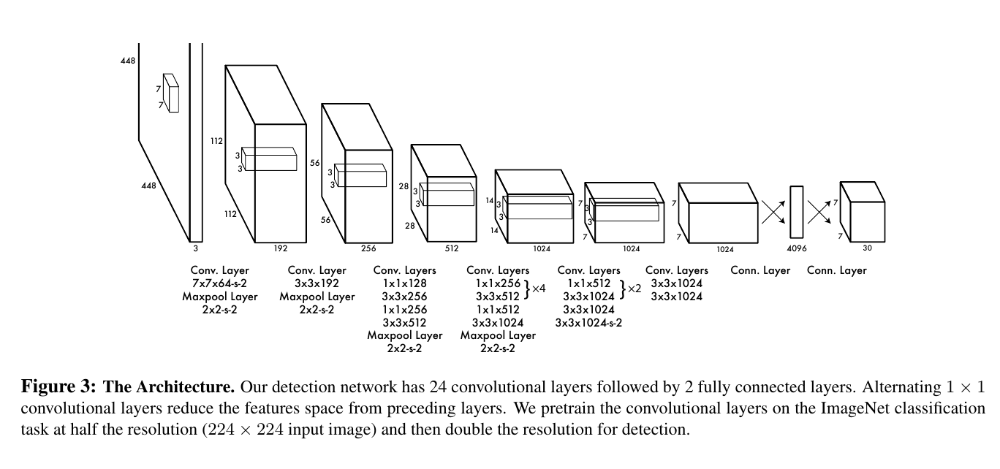
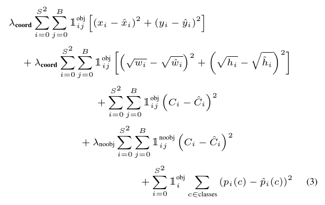

### 写在前面的话　　
十一假期没有出去玩，待实验室想多看看目标检测的论文和代码，用faster rcnn实现了人脸检测，进一步了解了如何制作pascal voc数据集格式，如下图所示：　　
  
好吧，确实有点帅的一张脸，对于你那些比较小的人脸还是无法检测出来，原因可能和数据集有关系，数据集中没有多张人脸、小人脸的样本，因此对于大一点的人脸检测效果比较好。
不管咋说，一趟流程可以走下来，可以训练自己想要检测的目标。今年十一不出去，踏实看论文，今天讲YOLO,ross二作，接下来就仔细讲讲它的细节。　　

## YOLO:You Only Look Once  
如果说RCNN系列是将检测视为分类问题，那么YOLO和后面讲到的SSD则是将检测视为回归问题。下图为YOLO的简易框架:  
  
由上图可以看到，yolo十分简单，输入一张图片，经CNN提取特征，直接得到类别，bbox,然后利用NMS得到最佳的框。　　

### Unified Detection  

yolo直接使用来自一整张图片的特征(由CNN提取)去预测bounding box,同时预测出所有类别。具体来说，就是
yolo将输入的图片分成SxS的grid，如果一个目标的中心落入grid center,则说明这个grid对于检测这个目标时有贡献的,即这个grid是属于object的一部分或者是一个object,
而每一个grid经过网络预测得到B个bounding boxes和confidencet score(就用英文吧，高大上一点)，置信度反映bbox包含目标的可信度和它的准确性，可以用下面式子表示：
$$cs = Pr(object)*IOU^{truth}_{pred}$$其中*Pr(object)*表示预测目标的概率，如果在grid中不存在目标，则置信度为0；IOU表示预测bbox和ground truth 之间交叠的区域。　　

每一个bounding Box包含5个预测值：x, y, w, h, confidence。(x, y)表示相对于grid边界的bbox的中心位置，w,h则时相对于整张图片的width和height，最后IOU表示预测bbox和ground
turth之间交叠的区域；当然，每个grid cell同样预测C个类条件概率$$Pr(class_{i}|object)$$，这些概率时基于grid包含的目标预测得到的，它的个数至于grid个数和类别数有关，和
每个grid生成B个bboxes个数无关。在预测阶段，将$$Pr(class_{i}|object)$$和cs相乘，则可得到每个box的类别置信度：　　
$$\begin{equation}
Pr(class_{i}|object)*Pr(object)*IOU_{pred}^{truth}=Pr(class_{i})*IOU_{pred}^{truth}
\end{equation}$$  

具体化图示如下图所示：　　

  

如图下方描述，网络最终输出为一个张量$$SxSx(B*5+C)$$.  

### Network Design  

网络结构为自行设计的，其中包含了1x1的卷积层和3x3的卷积层，当然文章还给出了其他版本的网络结构，这里拿大头来讲。　　

  

具体参数如图所示，这里看出来的是，目标检测任务需要细粒度的信息，如高分辨率的图片，因此文章将imagenet model的输入224x224改为448x448,
以此来使得目标检测更为容易。　　　

### Train  

对于训练，文章使用自定义的网络结构，因此文章首先将model在imagenet数据集上进行pre-train,然后去掉fc layers用于目标检测的pre-train模型。
在模型优化更新的过程中，作者做出了一些目标函数上的改进。　　

首先，文章使用的是均方误差，原因在于它比较容易最优化，然而，它并不能完美的与目标检测的目的相符，即均方误差和分类误差不一样，分类误差是概率，均方误差是距离，
因此使用均方误差来衡量分类是不理想的，当grid中不包含object时，connfideng score为0，会这部分loss对于梯度更新应该贡献很小，因为我们只关注检测目标，而不关心那些
没检测到目标的部分，损失应该较大程度的来自于目标部分，即压制了那些来自包含目标的grid的梯度，这
容易使得模型不稳定不易收敛。为解决这个问题，作者加大对bbox回归误差的惩罚，减少loss来自于不包含目标的grid,详细见公式。　　

  

同样的，均方误差对于大的bboxes和小的bboxes,一视同仁，我们知道对于相同的变动，小的bboxes比大的bboxes更为敏感，因此作者目标函数里使用了开方的形式，这样使得大的变化
不如小的变化造成的影响大。即类似于log函数将图像的暗处显现出来道理一样。

### YOLO的缺点　　

* yolo由于预测得到bbox和类别，是基于grid,可以想想如果一个grid里面有包含对个目标，如小鸟这类小目标，yolo则不能很好的都检测出来，依赖于grid的划分选取大小。
* yolo对于新的aspec ratios不能很好的检测
* 对于在大的bboxes和小的bboxes上的错误一视同仁，但是我们知道小bboxes上的错误更为重要　　

### 写在后面的话　　

对于目标检测，发现是个神器的领域，不管是学术还是工程，很实干，因此想好好学学，研究研究。也没想过会感兴趣，结果感兴趣了。还是佩服这帮大婶们，虽然我不喜欢学术，但是
论文我还是喜欢读的。　　
十一假期没心思玩，只想好好做做自己的事情，不论时学习，还是娱乐，都想做做自己的，今天下午看到剑雪封喉的视频了，怀念本科躺床上，听大力和阿忆在地上看视频的日子，真好～
