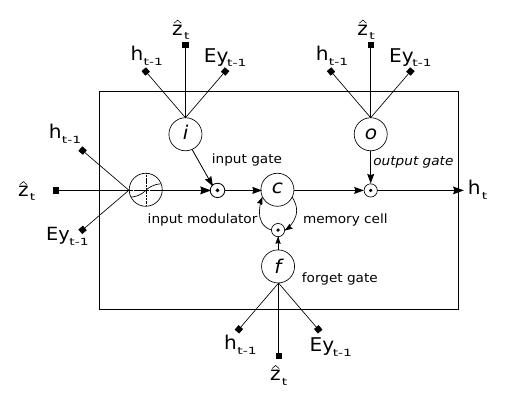
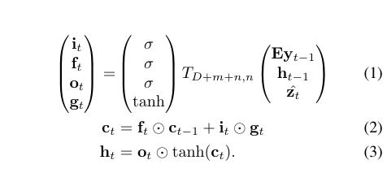
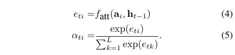
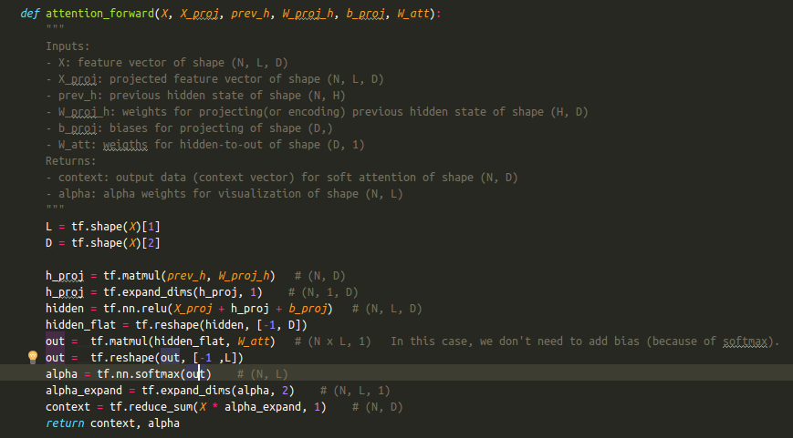

---
layout: post
title: Show, Attend and Tell, Neural Image Caption Generation with Visual Attention
tag: paper
category: paper
comments: true
blog: true
data: 2016-10-19
---  

最近终于入了attention机制的坑了，为什么呢，因为在object detection和各种VQA, 图像生成描述里面，都有这个东西，路子必须广~. 文章[^1]
主要阐释一种attention based model，用于自动学习图像的描述，即在给定图片的情况下，可以自动生成图像描述。如下图所示：  

  

这张图片对应描述为:"A woman is throwing a frisbeen in a park"。训练模型的目的就在此。开讲了～　　

## Image Caption Generation with Attention Mechanism  

模型主要分为两块：  
　　
* Encoder: CNN,用于提取图片区域特征   

* Decoder: LSTM,用于将特征解码为描述信息  

### ENCODER: CONVOLUTIONAL FEATURE  

这里文章使用CNN去提取图片特征，如$$224\times224$$的图片经VGG之后可以得到$$14\times14\times512$$的feature maps,然后将其flatten成
如下格式:$$a = {a_1, ..., a_L}, a_i \in R^D$$,其中，L为向量的个数，每一个$$a_i$$是一个feature map, 若vgg则为$$14\times14=196$$．当然，为了获取图片对应位置的描述，文章使用底层卷
积层的feature, 因为low-level feature能够保留较多的图片信息，不像fully-connected layer feature,位置信息也丢掉了。　　

### DECODER: Long Short-Term Memory Network  

解码阶段，文章使用lstm如获取最后的单词的预测。lstm可如下图所示，　　

  

话说这张图我一开始看到是拒绝的，总觉得很复杂，后来发现，其实很清晰，大多博客里面都把它写复杂化了。公式还是贴图:  

    

其中，i,f,o分别对应输入，遗忘，输出，在给定y(embeding vector), z(图片的上下文信息，即关注点)时，可以得到对应i,f,o,然后利用i,f,o
更新cell,最后利用cell来更新隐藏层到隐藏层的输出。有木有很清晰*_*    

那么问题来了，z从哪里来，文章给出了解释：　　

   

即在给定输入a和已知隐藏层到隐藏层输出时，通过函数$$f_{att}$$映射得到e,利用e可以得到对应的概率，具体可以如下面代码表示：  

   

上下文z可以通过两种attention方法得到，以上是利用soft attention实现的，$$z_t = \phi({a_i}, {\alpha_i})$$，接下来我们就讲讲attention机制。　　

### "Hard" or "Soft" Attention

这部分公式比较多，因此就不贴了，详细看论文, 这里主要说一下二者的差异。　　

对于hard attention, 每次的候选位置是通过随机采样得到的，如果看文章，会发现这么个栗子：$$s_t ~ Multinoulli_L({\alpha_i})$$,这就是采样的式子，
可以看出是针对每个caption来采样的，$$\alpha_i$$表示每一个位置上s=1的概率，然后在得到$$\alpha_i$$之后，通过与图片的乘积，可以得到注意力区域。　　

对于soft attention,则是通过注意力区域的期望来近似得到上下文z,其中$$\alpha_i$$则是通过softmax得到，这使得每次z仅仅通过计算sofrmax可以得到。对应目标函数
为　　

$$
\begin{equation}
L_d = -log(P(y|x)) + \lambda\sum_{i}^{L}(1-\sum_{i}^{C}\alpha_{ti})^2
\end{equation}
$$  

目标函数即在给定输入x时，对应y的最大概率，而惩罚项表示关注错误的区域会得到较大的惩罚，对loss会有较大的贡献，而对于关注正确的区域，则减小惩罚力度。详细代码可以
看这里[show-attend-tell](https://github.com/yunjey/show-attend-and-tell), 论文看这里[Show, Attend and Tell: Neural Image Caption Generation with Visual Attention](http://arxiv.org/abs/1502.03044)

### 写在后面的话　　

一直想着马拉松应该不会被抽中，还是被抽中了，第一次跑全马啊，最近一直在跑步，调整跑姿，希望到时候不会太坑，感觉自己啥都看，可能是老板给的课题资源太少，多看，没错的，
我一直这么觉得。   

### Reference  

[^1]:Xu K, Ba J, Kiros R, et al. Show, Attend and Tell: Neural Image Caption Generation with Visual Attention[J]. Computer Science, 2015:2048-2057.
