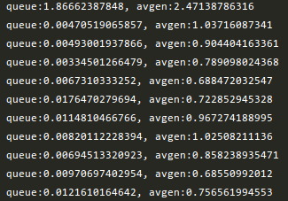
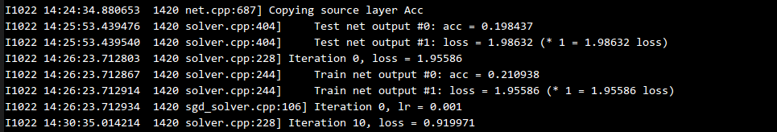
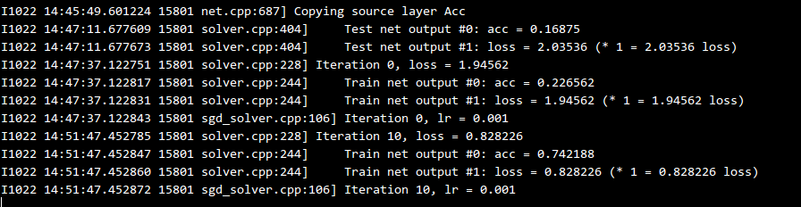

---
layout: post
title: Python 多线程队列在读取大数据时的应用
tag: python
category: python
comments: true
blog: true
data: 2016-10-22
---  


### 多线程小试　　

今天在使用python写caffe数据读取层，发现在数据读入网络时速度有些慢，之前由于内存不足引入了生成器，发现了生成器这么个利器，如今在
读取数据时，想要提升数据读取速度，有以下三种方式:  

* 改写C程序   

* 增加预取阶段  

* 增加多线程  


第一点不予考虑，毕竟改写不如优化来的快。针对下面两点，可以使用多线程和队列。先上代码:  

```python
def generator_queue(generator, max_q_size=10,
                    wait_time=0.05, nb_worker=1, pickle_safe=False):

    generator_threads = []
    if pickle_safe:
        q = multiprocessing.Queue(maxsize=max_q_size)
        _stop = multiprocessing.Event()
    else:
        q = queue.Queue()
        _stop = threading.Event()

    try:
        def data_generator_task():
            while not _stop.is_set():
                try:
                    if pickle_safe or q.qsize() < max_q_size:
                        generator_output = next(generator)
                        q.put(generator_output)
                    else:
                        time.sleep(wait_time)
                except Exception:
                    _stop.set()
                    raise

        for i in range(nb_worker):
            if pickle_safe:
                # Reset random seed else all children processes share the same seed
                np.random.seed()
                thread = multiprocessing.Process(target=data_generator_task)
            else:
                thread = threading.Thread(target=data_generator_task)
            generator_threads.append(thread)
            thread.daemon = True
            thread.start()
    except:
        _stop.set()
        if pickle_safe:
            # Terminate all daemon processes
            for p in generator_threads:
                if p.is_alive():
                    p.terminate()
            q.close()
        raise

    return q, _stop, generator_threads
```  

上述代码来自[keras](https://github.com/fchollet/keras/blob/master/keras/engine/training.py),因为keras存在一种model训练方式`fit_generator`,可
将`generator`传入作为数据读取器，并通过多线程来读取数据，由上述可以看到，创建四个线程，这些线程负责从`generator`中并行读取数据到队列中，
然后，我们可以从队列中获取数据，效果显而易见，如下图所示：　　

  

上图是直接从生成器中读取数据与通过多线程读取数据的耗时对比，在初期读取数据时，由于队列为空，因此耗时较多，但是在后续队列为满时，获取数据则较为迅速。
但是，不知道是不是错觉，感觉加入数据读取时的多线程，感觉在求导时候速度慢了许多，下图为测试图：　　


  　　

上面的图为多线程，下面为单线程，看来本来就慢，只不过在数据读取过程稍微快了那么一点点，汗，因为python_layer在c++方面用了多线程，因此变化不是很大。不过在python读取大数据内存不足情况下可以使用这种方法，当然，使用数据库使最好的。　　

### multiprocessing和queue  

对于`multiprocessing`,主要用来创建多进程，python解释器有GIL机制，因此的python的多进程可以通过创建多个独立的解释器来实现，为了使用子进程，可以通过`Process`来构造子进程，　　

```python
from multiprocessing import Process
```  

在通过`p = Process(target=func, args=(args))`来构造子进程，然后通过`p.start()`来启动子进程，`p.join()`使得子进程运行结束后再执行父进程，详细可以
参看[multiprocessing](https://docs.python.org/2/library/multiprocessing.html).  

对于队列，有两种实现，一种是内置模块`Queue.Queue`,另外是`multiprocessing.Queue`,后者近乎是前者的拷贝，这里为什么使用队列，因为队列FIFO机制，这样会保证进程安全，获取数据时不会乱序，只有一个出口。
队列有几个方法：　　

* `q = Queue(length)`: 构造长度为`length`的队列。　　
* `q.put(item)`: 将`item`放入队列中，这里可以是一个数，可以是数组等一系列对象。　　
* `q.get()`: 获取队首元素。　　
* `q.full()`: 队列是否为满，满为`True`。  
* `q.qsize()`: 返回队列大小。　　
* `q.empty()`: 队列为空，返回`True`  

详细参看[Queue](https://docs.python.org/2/library/multiprocessing.html#multiprocessing.Queue)  

### 写在后面的话　　

最近越来越对导师失去信心，学术本来是很纯粹的东西，在他眼里夹杂了太多的利益关系，人家只想静静的多看几篇paper...，希望可以坚持下去!
