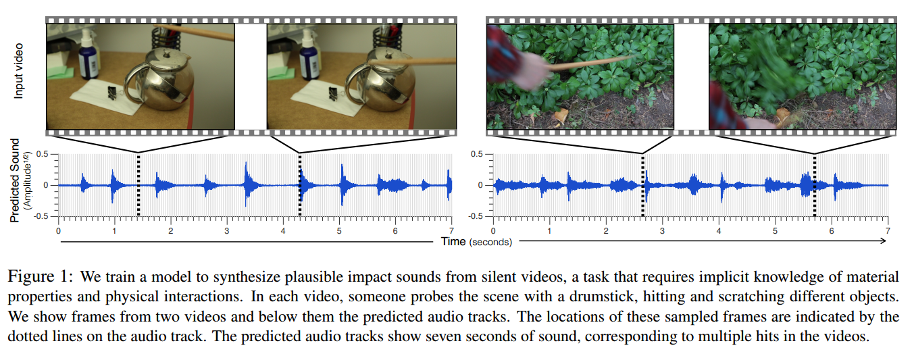
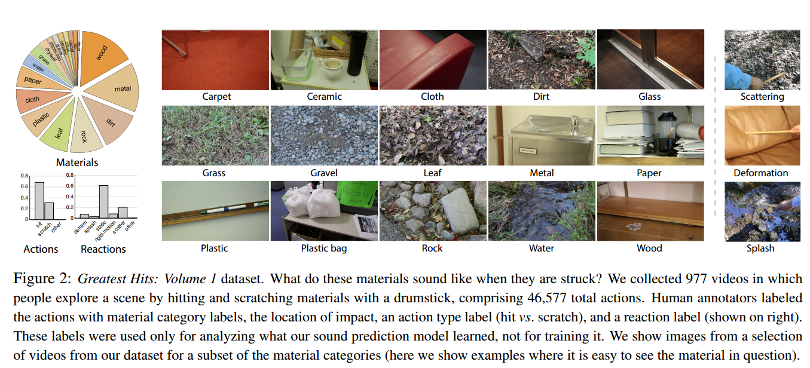
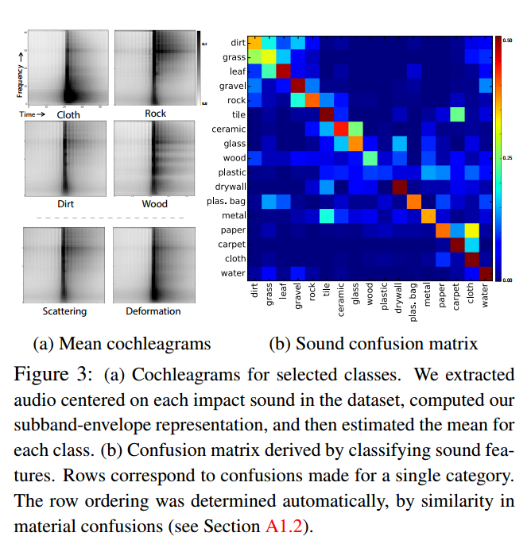
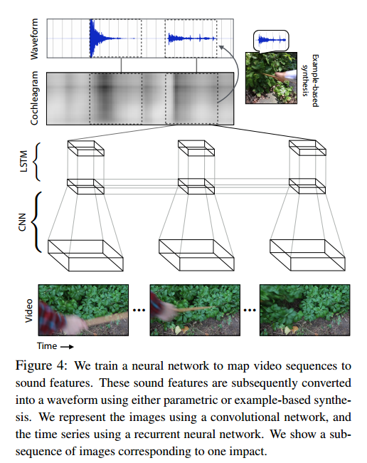
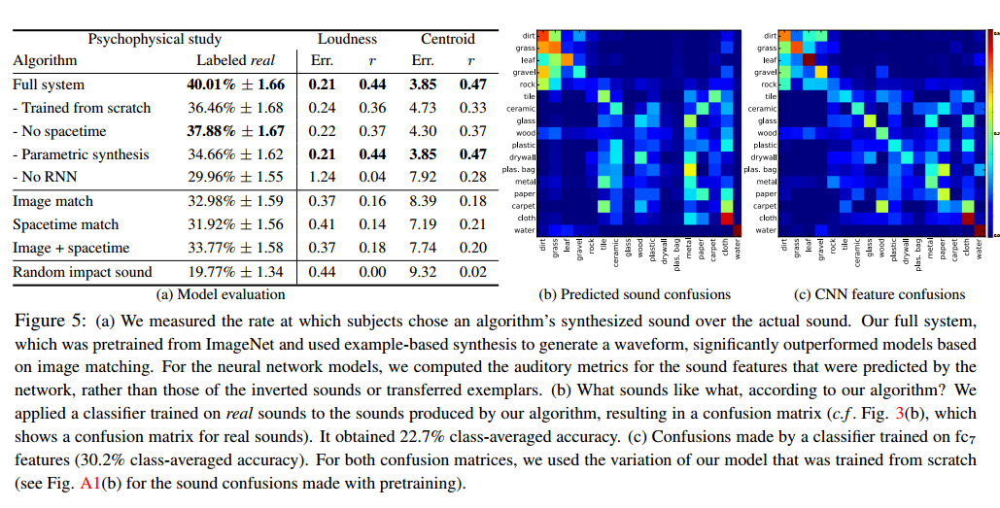

---
layout: post
title: Visually Indicated Sounds
tag: paper
category: paper
comments: true
blog: true
data: 2016-10-24
---  

不同物体被打击或者刮的时候会发出不同的声音，而且具有一定的区分性，而且对于人来说，当我们看一步无声电影，其中比如敲击鼓，刮玻璃
我们都可以在脑中脑补出它们的声音，因此，这篇文章[^1]就是要做这么一件事，如下图1所示：    
  
即在给出无声video，其中包含一些动作，如上图中的敲水壶，打击草丛，然后将其应该对应的声音预测出来，注意是预测出来，不仅仅是预测
是什么声音，这就好比给出视频补出视频的audio。该如何做，文章从下面几点来分别描述：  

* Datasets  
* Sounds Representation  
* Video feature Representation
* 训练模型的设计  

接下来我们一一进行讲解。  

### Datasets  

为了研究visually indicated sounds, 文章收集了他们自己的数据集**Greatest Hits**，其中包含作者自己用鼓槌在不同场景下的
动作，如下图2所示：  
  

作者选择鼓槌，目的在于他们可以有一个确定的方法生成对应的语音，即降低了难度，如果一会棒槌，一会锤子，组合起来很多钟声音，
如不同打击物打击一样的东西声音不同，相同的打击物打击不同的物体声音也不同，因此固定一个不动，减小实验难度。而且，鼓槌细长，不会对
被打击物造成遮挡，或者不会遮挡太多，这样以来可以观察到物体被打击之后的形变等，这里叫reaction，通过reaction可以推测出被打击物的
材料，如图2所示，鼓槌打击皮沙发，发出的声音是离散的，而对应的reaction是比较缓慢的，而且形状变化比较固定；相比叶子，草等，被打击时
会产生soso的声音，变化幅度也比较大。  
当然，为了观察到物体被打击之后的细微变化，对物体进行了特写(close-up views)，这样图片信息可以包含较多的细微纹理变化以及在打击之后的
reaction，数据集关注打击，对于他的身份和场景不关注。具体数据集可以参看文章详细描述。  

### Sound representation  

文章使用的Sound features不是mfcc，而是原始waveform，利用原始waveform进行decompose得到subband envelopes(ps:这里在issue里面进行解释)，用文章原话：a simple representation obtained by filtering the waveform and applying a nonlinearity，看起来像是使用类似FC layer 的手法进行$$w \times x + b$$,有waveform到Sound representation的变换可以如下面式子表示：    

$$s_{n} = D(|(w * f_n) + jH(w * f_n)|)^c$$  

其中$$H$$为Hilbert transform， $$D$$是下采样操作，$$c = 0.3$$是压缩常数，$$f_n$$是滤波器，也就是滑动窗口，$$w(t)$$表示原始waveform， 由公式可以看出，将原始信号通过加窗然后进行希尔伯特变换，最后将原始加窗操作后的特征与希尔伯特特征进行相加然后再进行压缩，得到最后的subband envelope， 最后得到特征称为**cochleagram**,文章中将对应材料和reaction的mean cochleagram进行可视化，如下图3所示：  
  
图三左边表示的就是cochleagram，纵轴为频域，横轴为时域，可以看出，Cloth打击声音多为低频，Rock多为高频，由此可以看出不同材料的打击声具有一定的区分性(基于这种特征)。右图为使用cochleagram特征对材质进行分类的cofusion matrix，结果表面该特征与材料有一定的语义关系。  

### Video Representation  
对于一系列图片构成的动作以及reaction，video为时间序列，因此文章考虑使用RNN或LSTM来映射video与Sound。对于video分为两种图片，一种为原始图片，另外一种为spacetime images。对于spacetime图片，文章如此提取，对于每一帧video，将previous， current， next frames的三张图片转为灰度图，然后合起来作为一张三通道图片，这种表示输入CNN后，类似3D CNN,因为在求导的时候可以通过三个通道求导，类似一个video block。对于每一帧，文章构建输入特征$$x_t$$:如下式子表示：  

$$x_t = [\phi(F_t), \phi(I_1)]$$  

这里看到，特征$$x_t$$是通过将原始图片I和spacetime images输入CNN之后得到的特征向量的Concanate，这里值得注意的是，将时刻t的spacetime images与第一帧的原始图片输入CNN后进行拼接(ps:这里应该是video CNN的常用手法，待我后续查查)。这样便得到了每一帧video Representation，但是由于Sound与video的采样率的不同，因此需要将他们对齐，因为最终我们要通过一系列动作预测出对应动作发出的声音。文章是这么做的：Sound有$$T$$段，而video features有$$N$$)段，因此计算之间倍数$$k = T/N$$, 然后将CNN feature vector重复$$k$$)次作为与一段sound对应的video features。  

### 训练模型  
文章将此任务视为回归问题，即通过将video 序列输入到模型中，最后与对应sound block特征进行回归，模型可以如下图4所示：  
   
正常的CNN+RNN pipline,每个时间步输入image features vector $$x_t$$可以用作更新隐含层，而每个时间步，RNN都输出sound signal$$\bar{s_t}$$和$$h_t$$，这里就不敲公式了，经典的one to one，即输入一个输出一个。损失函数如下是所示：  

$$E(\bar{s_t}) = \sum_{t=1}^{T} \rho(||\bar{s_t} - \bar{s_t}^{'}||_2)$$  

其中$$\rho(r) = log(\sigma + r^2)$$, $$\sigma$$是很小的数，防止对数部分为0。当然，为增加模型鲁棒性，ground true可以是subban envelopes， 为了训练简单可以使用envelope值，而且可以使用PCA对sound feature降维减小自由度，增加模型训练可行性。  

### 剩下的步骤  
* 生成waveform利用预测sound feature
* 由于上述皆在视频与sound对齐的情况下进行的，如果不是对齐的，任务则变为sound detection，即声音什么时候开始的不知道，需要通过对被打击物的变化进行声音的感知，具体可以参看文章。    

### Results
贴一下结果图：  
   
上图为各种预测性能对比，可以看到准确率没过50%，即使是最高的，看来是个大坑啊(偷笑)。这篇文章就写到这里，剩下的文章实现细节issue里面会更新，当然这是说给我自己听了，谁会翻到我这个repo里面的wiki呢~

写在2016.10.23  

### 参考文献  
[^1]: Owens A, Isola P, Mcdermott J, et al. Visually Indicated Sounds[J]. Computer Science, 2016.
