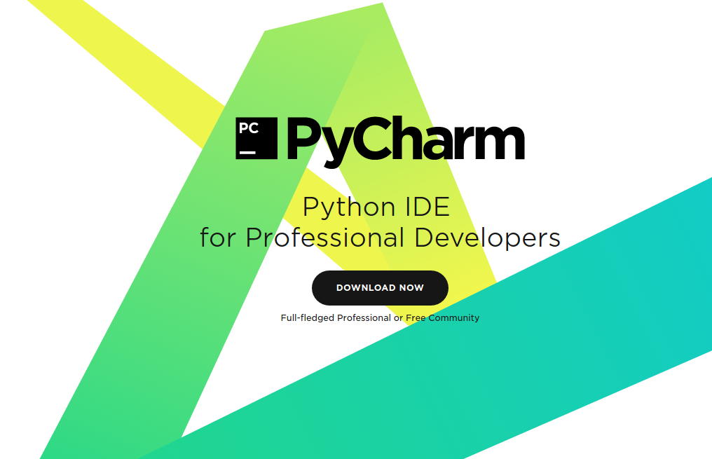
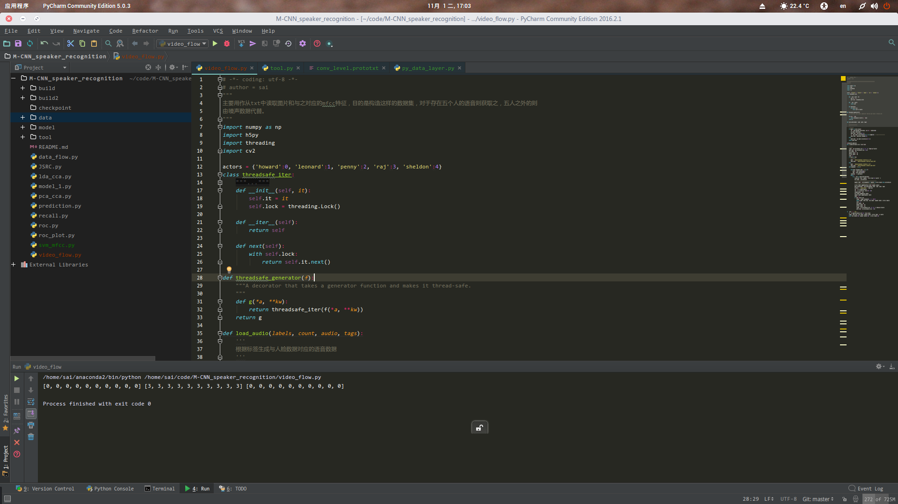

有时翻看自己的系统，不由的担心万一那天崩掉这么多配置好的环境去哪里找，因此想整理出一篇blog记录一下自己迄今为止用过的比较好的软件，以防不测。　　

## 编程篇　　
对于程序猿/媛来说，好的编程环境是有必要的，更何况对于从windows迁移过来的那些小伙伴，肯定急需要搭建器自己的coding environments。由于本猿是一枚python使用者，有时候也会使用c++,因此这里就针对这两门语言的环境进行描述。　　

### Python  
对于python而言，在linux下简直如鱼得水，而对于集成环境的搭建，即免去自己费尽心思去安装各种基本库，排解各类不兼容问题，游走于stackoverflow的麻烦，推荐新手使用[Ananconda](https://www.continuum.io/downloads)，当然还有别的集成库，如[minconda](http://conda.pydata.org/miniconda.html)。在基本库的安装完毕之后，我们这时需要一款顺手的IDE，当初博主学习python时候由于没人带，走了不少坑，用过[sublime](http://www.sublimetext.com/)，[Atom](https://atom.io/),当然还有最近的[VS code](https://code.visualstudio.com/?utm_expid=101350005-31.YsqwCVJESWmc4UCMDLsNRw.0&utm_referrer=https%3A%2F%2Fcode.visualstudio.com%2F),以上三款均为文本编辑器，并不是正统的IDE,值得一提的是，vscode是一款比较好用的文本编辑器，和sublime差不多。虽说可以配置成类似IDE功能，但是在初期，使用IDE比使用文本编辑器会好一点，后面如果熟练之后使用使可以，因为学习文本编辑器的时间不如用来学习coding。言归正传，说说我用过的IDE.  

#### [Pycharm](https://www.jetbrains.com/pycharm/)  
  　　
使用效果如下图所示：　　
  
让你有个直观的感受，pycharm是一款比较好的IDE,最主要的是社区版简直不要太好用，支持各类插件，支持debug，支持大型项目，github等版本控制系统。比较而言下面这个....
#### [WingIDE](http://wingware.com/)  
wingIDE是一款也不错，对于国内小伙伴来说肯定不愿意花钱去买一款IDE,这也成了使用人群不是很大的问题，值得一提的是，wingide补全功能简直不要太厉害，文档支持也很给力，这是我最开始使用它的原因。　　

上述两款IDE就是我用过觉得还不错的IDE,这时候肯定有人会问Eclipse,我只想说，eclipse太大了，虽然使用插件可以达到使用python的程度，但是毕竟不是传统python专用ide.IDE主要用在大型工程时好管理，如果你是大牛，vim一样可以用的很溜，那句话说的好，别管黑猫白猫，能抓住老鼠的就是好猫。因此，只要对你写代码有帮助，何必纠结于文本编辑器，IDE，VIM(黑人???)。好啦，python IDE就说道这里。接下来我们说说C++.  

### C++  
有人一直在说c++必须使用vs，这又回归到上面那句话，我们不必纠结于这类工具问题，写出好代码才是我们想要做的。这里我也是仅把我在使用的介绍给大家，希望对刚转到这个平台下的新人有所帮助。　　
对于c++而言，这里我不说上述文本编辑器了，因为他们基本啥子语言都可以编写，这里两条路：一条路是使用文本编辑器+gdb对代码进行调试，gcc对代码进行编译，cmake，make对工程进行编译；另外一条路，则是使用集成环境，这里推荐两款IDE。　　

#### [qtcreator](https://www.qt.io/download/)  
qtcreator可以说是linux下的c++神器，可以做界面，可以编写各类与qt无关的程序，由于我做机器学习，深度学习，编译caffe便是使用这个。最主要的可以配置各种运行参数，可以把一系列脚本作为运行命令。　　

除此之外各类语言的IDE可以去找[Intellij IDEA](https://www.jetbrains.com/products.html?fromMenu),做的越来越好了。编程篇就讲到这里啦。　　

## 日常软件篇