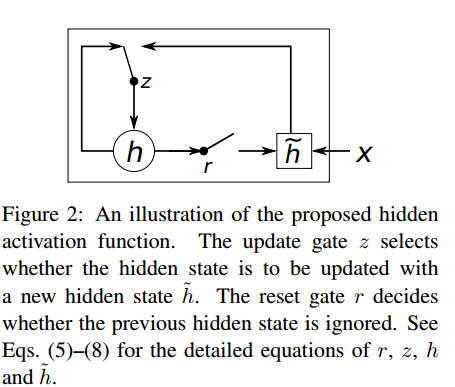
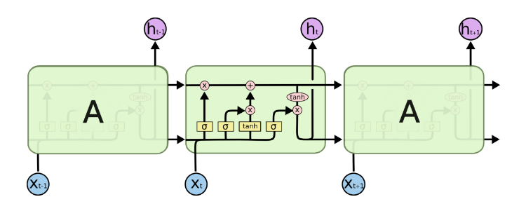

## 抽象类RNNCell  

所有的rnncell均继承于RNNCell, RNNCell主要定义了几个抽象方法：  

```python
def __call__(self, inputs, state, scope=None):
    raise NotImplementedError("Abstract method")

@property
def state_size(self):
    raise NotImplementedError("Abstract method")

@property
def output_size(self):
    raise NotImplementedError("Abstract method")

```  

上述方法，`__call__`在对象被使用时调用，其他可以看做属性方法，主要用作获取状态state的大小，cell的输出大小。既然对象使用时会调用`__call__`，那么各类RNN的操作都定义在这个方法中。接下来，我们就针对各个不同的cell来详细介绍各类RNN。    

## BasicRNNCell  

这个cell是最基础的一个RNNCell，可以看做是对一般全连接层的拓展，除了在垂直方向，在水平方向加入时序关系，可以用下图表示：  

  

而BasicRNNCell的初始化方法可如代码所示：  

```python
def __init__(self, num_units, input_size=None, activation=tanh):
    if input_size is not None:
      logging.warn("%s: The input_size parameter is deprecated.", self)
    self._num_units = num_units
    self._activation = activation
```  
初始化只需要给出`num_units`,用来指有多少个隐藏层单元；而`activation`指使用哪种激活函数用作激活输出。而对应的RNN操作定义在`__call__`方法中：  

```python
def __call__(self, inputs, state, scope=None):
    """Most basic RNN: output = new_state = activation(W * input + U * state + B)."""
    with vs.variable_scope(scope or type(self).__name__):  # "BasicRNNCell"
      output = self._activation(_linear([inputs, state], self._num_units, True))
    return output, output
```  

很清晰，`inputs`表示隐藏层的输入，`state`表示上个时间的隐藏层状态，也可以说是上一次隐藏层向自身的输出，对于第一次输入，则需要初始化`state`,对应初始化方法有很多种，可以使用tensorflow提供的各种初始化函数。在`__call__`中，对输入`inputs`和`state`进行`activation(wx+b)`,用作下次的输入。

## GRUCell  

GRU是对RNN的一种改进，相比LSTM来说，也可以看做是对LSTM的一种简化，是Bengio在14年提出来的，用作机器翻译。先看一下GRU的基本结构：  

  

这里我们结合代码来看原理：  

```python
def __call__(self, inputs, state, scope=None):
  """Gated recurrent unit (GRU) with nunits cells."""
  with vs.variable_scope(scope or type(self).__name__):  # "GRUCell"
    with vs.variable_scope("Gates"):  # Reset gate and update gate.
      # We start with bias of 1.0 to not reset and not update.
      r, u = array_ops.split(1, 2, _linear([inputs, state],
                                           2 * self._num_units, True, 1.0))
      r, u = sigmoid(r), sigmoid(u)
    with vs.variable_scope("Candidate"):
      c = self._activation(_linear([inputs, r * state],
                                   self._num_units, True))
    new_h = u * state + (1 - u) * c
  return new_h, new_h
```  

GRUCell的初始化与RNN一样，给出输入和初始化的state，在使用对象时，利用输入和前一个时间的隐藏层状态，得到对应的`Gates`: r, u, 然后利用r更新cell状态，最后利用u得到新的隐藏层状态。对于RNN的改进，最厉害的莫过于下面的，而且有很多变种，这里tensorflow中只有几个简单常见的cell。接下来，我们开始看看LSTM。  


## BasicLSTMCell  

这个cell可以看做是最简单的LSTM，在每个连接中没有额外的链接，即其他变种在连接中加入各种改进。对于BasicLSTMCell,可以如下图所示：  



同样的，我们结合代码来看它的原理：  

```python
def __call__(self, inputs, state, scope=None):
  """Long short-term memory cell (LSTM)."""
  with vs.variable_scope(scope or type(self).__name__):  # "BasicLSTMCell"
    # Parameters of gates are concatenated into one multiply for efficiency.
    if self._state_is_tuple:
      c, h = state
    else:
      c, h = array_ops.split(1, 2, state)
    concat = _linear([inputs, h], 4 * self._num_units, True)

    # i = input_gate, j = new_input, f = forget_gate, o = output_gate
    i, j, f, o = array_ops.split(1, 4, concat)

    new_c = (c * sigmoid(f + self._forget_bias) + sigmoid(i) *
             self._activation(j))
    new_h = self._activation(new_c) * sigmoid(o)

    if self._state_is_tuple:
      new_state = LSTMStateTuple(new_c, new_h)
    else:
      new_state = array_ops.concat(1, [new_c, new_h])
    return new_h, new_state
```  

lstm有三个门，inputs, forget, output, 而中间cell用来管理结合他们生产需要的输出。在初始化结束之后，利用输入分别得到对应的门的输出，然后利用这三个门的信息分别更新cell和当前隐藏层状态。f用来控制遗忘之前的信息和记忆当前信息的比例，进而更新cell，latm可以看做是一种复杂的激活函数，它的存在依赖RNN的递归性。BasicLSTMCell只是个最基本的LSTM，而完整的LSTM可能比这个复杂，可以参看[blog](http://colah.github.io/posts/2015-08-Understanding-LSTMs/),同样的LSTNCell，是在此基础上加入各种连接，算是变种。深入理解还需论文，博客。

## MultiRNNCell    

对于MultiRNNCell，只能贴出完整代码来分析了：  

```python
class MultiRNNCell(RNNCell):
  """RNN cell composed sequentially of multiple simple cells."""

  def __init__(self, cells, state_is_tuple=False):
    """Create a RNN cell composed sequentially of a number of RNNCells.

    Args:
      cells: list of RNNCells that will be composed in this order.
      state_is_tuple: If True, accepted and returned states are n-tuples, where
        `n = len(cells)`.  By default (False), the states are all
        concatenated along the column axis.

    Raises:
      ValueError: if cells is empty (not allowed), or at least one of the cells
        returns a state tuple but the flag `state_is_tuple` is `False`.
    """
    if not cells:
      raise ValueError("Must specify at least one cell for MultiRNNCell.")
    self._cells = cells
    self._state_is_tuple = state_is_tuple
    if not state_is_tuple:
      if any(nest.is_sequence(c.state_size) for c in self._cells):
        raise ValueError("Some cells return tuples of states, but the flag "
                         "state_is_tuple is not set.  State sizes are: %s"
                         % str([c.state_size for c in self._cells]))

  @property
  def state_size(self):
    if self._state_is_tuple:
      return tuple(cell.state_size for cell in self._cells)
    else:
      return sum([cell.state_size for cell in self._cells])

  @property
  def output_size(self):
    return self._cells[-1].output_size

  def __call__(self, inputs, state, scope=None):
    """Run this multi-layer cell on inputs, starting from state."""
    with vs.variable_scope(scope or type(self).__name__):  # "MultiRNNCell"
      cur_state_pos = 0
      cur_inp = inputs
      new_states = []
      for i, cell in enumerate(self._cells):
        with vs.variable_scope("Cell%d" % i):
          if self._state_is_tuple:
            if not nest.is_sequence(state):
              raise ValueError(
                  "Expected state to be a tuple of length %d, but received: %s"
                  % (len(self.state_size), state))
            cur_state = state[i]
          else:
            cur_state = array_ops.slice(
                state, [0, cur_state_pos], [-1, cell.state_size])
            cur_state_pos += cell.state_size
          cur_inp, new_state = cell(cur_inp, cur_state)
          new_states.append(new_state)
    new_states = (tuple(new_states) if self._state_is_tuple
                  else array_ops.concat(1, new_states))
    return cur_inp, new_states
```  

创建对象时，可以看到初始化函数中不再是输入，而是变成了cells,即一个cell是一层，多个cell便有多层RNNcell。而在使用对象时，单层可以看做多层的特例，对于输入inputs和state，同时得到多个cell的当前隐藏层状态，用作下个时间步。看似麻烦，其实很简洁，就是加入了对多个cell的计算，最后得到的新的隐藏层状态即每个cell的上个时间步的输出。  

---  

### 写在后面的话  

好久没这个环节了，自从电脑坏掉之后，一直在重装系统，安装软件，很少踏实的弄一弄实验，一直在做与不做之间徘徊，一是因为我自己想工作并不像搞学术，而老板只知道催论文而一点指导都没有，因此见见看淡了这些，只想弄点自己喜欢的东西。这是个新的博客，从原来旧的迁过来的，很简洁啊，有木有。希望在毕业的那天，可以看到硕果累累。
