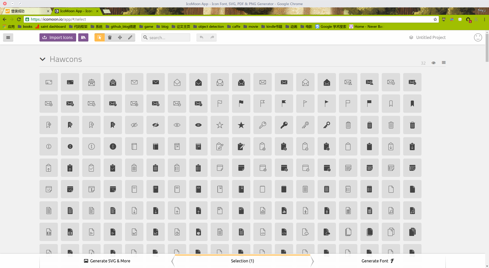
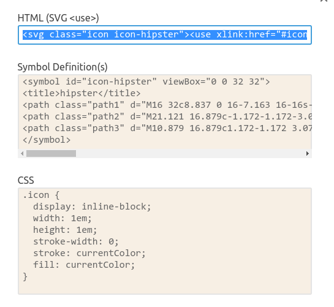
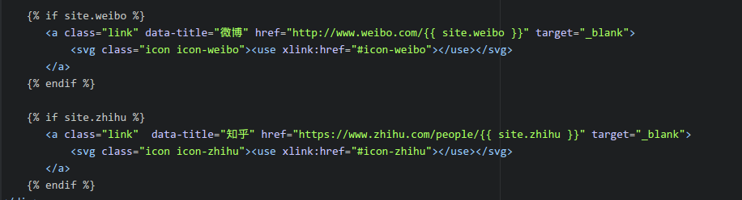
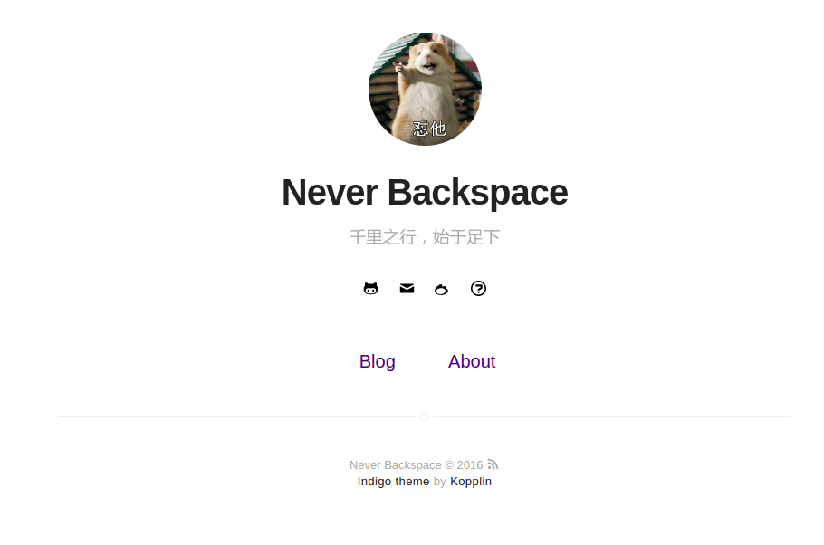

---
title: "为blog添加社交网络图标"
layout: post
date: 2016-11-23 15:41
image: ../downloads/icons/add_icon.png
headerImage: true
tag:
- elements
blog: true
category: elements
author: karl geng
description: 为博客添加社交网络图标
---  

今天突然想为blog添加一些链接，比如邮箱，weibo，知乎等这些社交网络，让访问博客的人可以更好的熟悉我，于是去度娘了一下，这里主要用到了一个网站[Icon_moon](https://icomoon.io/app/#/select/library),
这是个开源网站，免费提供很多icons,点击进入网站并点击右上角APP进入如下界面：  

  

在其中挑选合适的图标，然后点击右下角generate得到生成界面，在界面选择生成code，便得到了对应的svg代码。一般博客代码关于社交网络和图标的html文件置于`_include`文件夹，打开文件`icon.shtml`,在合适的位置，
添加网站下图中symbol define代码：  

  

然后修改名字，用于后续使用，接着打开文件'social-link.html',添加你想添加的社交网络账号的网址，注意格式，一般未网站个人资料的网址：  

  

如上图，我想添加新浪微博和知乎账号，在对应位置添加网址，然后引用svg文件，即在icons.html中定义好的svg,这样算是完成了添加工作。  

最后在_config.yml中添加对应的开关，比如这里`weibo`还有'zhihu'，这样就可以在首页实现社交网络的显示了。如下图：  

  

很简单吧～
