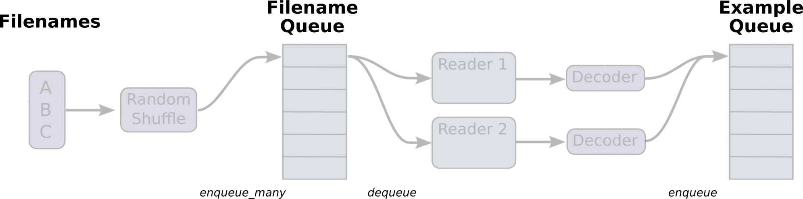

---
title: " tensorflow使用笔记(3)--Reading data(1)"
layout: post
date: 2016-11-25
image: /assets/images/markdown.jpg
headerImage: false
tag: tensorflow
category: tensorflow
blog: true
start: true
author: karl
description: 读取数据，从文件，从队列
---  

昨天试着用python生成器读取10k张图片，结果raise out of memory, 我在想生成器应该没这么惨吧。虽然使用的是keras，那也不至于直接out of memory, 但是后来使用caffe反倒没有报错，这是和caffe的训练机制有关系：caffe的一次迭代不是正常框架的一次迭代，而是一个batch,对应solver文件里的`test_iter`表示的也是多少个test batches,我就说那么多图片不可能几秒钟就读完。进入正题，今天来看看tensorflow如何保存数据到官方数据格式，然后进行读取。(ps:虽然是翻译的文档，但也算是一种理解)    

----

## Summary  

- Reading data
    - Feeding
    - Reading from files
        - Filenames, shuffling, and epoch limits
        - File formats
        - Proeprocess
        - Batching
        - Creating threads to prefetch using QueueRunner objects
        - Sparse input data
    - Preloaded data
    - Multiple input piplines  


----  

### Feeding  

tensoflow中的feed机制主要用于为`placeholder`变量提供数据，并在session运行是为其提供数据，声明方式以字典形式，如theano中的given类似：  

```python
with tf.Session() as sess:
    sess.run(trainer, feed_dict={placeholder_a: data_a, placeholder_b: data_b})
```  
因为tensorflow是先构造graph，然后运行，因此需要这种机制来为图提供数据。  

### 从文件中读取数据  
从文件中读取数据的流程基本可以如下面步骤：  

1. 得到文件名列表  
2. 对列表进行shuffle  
3. 设置epoch  
4. 构造队列用于存放文件名  
5. 构造一个读取文件的reader  
6. 从队列中读取文件名  
7. 对读取到的数据进行预处理    

#### 文件名， shuffle， epoch  

对于文件名列表，通常表示方法可以像这样：`['file0, 'file1]`或者`[('file%d' % i ) for i in xrang(2)]`,在tensorflow中可以使用`tensorflow.train.match_filenames_once`,其官方说明如下：    

```python
tf.train.match_filenames_once(pattern, name=None)
```  
功能：存取与pattern匹配的文件列表，只计算一次    
- Args:  
    - `pattern`: 一个文件名模式，可以使用glob获得  
    - `name`: 名字  

- Returns:  
    - 返回一个变量用于匹配pattern  

在获取匹配模式的变量之后，我们可以得到对应模式的文件名，下一步便是将filenames进行读取，tensorflow中，有`tf.train.string_input_producer`,可以构建一个FIFO队列用作存取文件名，我们可以看一下文档说明：  
```python
tf.train.string_input_producer(
    string_tensor,
    num_epochs=None,
    shuffle=True, seed=None,
    capacity=32,
    shared_name=None,
    name=None)
```  
功能：输出文件名到一个队列中。  

- Args:
    - `string_tensor`: 一个1-D可以生成string的string tensor。
    - `num_epoches`: 如果指定的话，每个字符串会重复生成num_epoches次数；反之，每个字符会被无限制的生成。
    - `shuffle`: 是否在每个epoch shuff strings。  
    - `seed`: 随机种子，只有`shuffle=True`才有用  
    - `capacity`: 设置队列的容量  
    - `shared_name`: 如果设置，该队列可以在不同的session下被共享，这里的名字应该是session的名字。  
    - `name`: 队列名字  
- Returns:  
    - 返回一个队列，同时一个绑定该队列的QueueRunner会被加入到graph 的QueueRunner中。
- Raises:  
    - ValueError: 如果strings_tensor是一个空列表，运行时将会raise ValueError。  

#### 文件格式  

选择合适的reader读取对应的文件格式，并且将获取的文件名队列传给reader的read方法。通常，read方法会返回一个文件标识符，一个record用作debug，还有一个字符串变量；通过一个decoder和一个conversion ops将字符串变量decode至tensors，即实现了文件名与图的接轨。  

##### CSV files  

对于csv格式的文件，可以使用`TextLineReader`，`decode_csv`可以读取。这两个方法如下说明：  

```python
class tf.TextLineReader.read(queue, name=None)
```  
tf.TextLineReader是一个类，继承至`tf.ReaderBase`,这里只介绍read方法，其余方法可以参考[API](https://www.tensorflow.org/versions/r0.11/api_docs/python/io_ops.html#TextLineReader)  

- Args:
    - `queue`: 一个字符串队列或者一个可变字符串tensor，用来表示一个队列的句柄。  
    - `name`: 操作的名字。  
- Reutrns:  
    - 返回tensor(key, values)    

```python
tf.decode_csv(
    records,
    record_defaults,
    field_delim=None,
    name=None
    )
```  
将csv转换成tensors,每一列对应一个tensor  

- Args:  
    - `records`: string类型的tensor,每一个string是具有csv类似格式的。  
    - `record_defaults`: tensor的默认值，如果records为空。
    - `field_delim`: 默认分隔符，csv为`,`。  
    - `name`: 操作符名称  
- Retures:  
    - 返回tensor列表，每一个tensor类型和`record_defaults`相同，每一个tensor与 `records`具有相同的大小。  

下面用一个例子来说明：  

```python
filename_queue = tf.train.string_input_producer(["file0.csv", "file1.csv"])
reader = tf.TextLineReader()
key, value = reader.read(filename_queue)
# Default values, in case of empty columns. Also specifies the type of the
# decoded result.
record_defaults = [[1], [1], [1], [1], [1]]
col1, col2, col3, col4, col5 = tf.decode_csv(value, record_defaults=record_defaults)
features = tf.pack([col1, col2, col3, col4])
with tf.Session() as sess:
    # Start populating the filename queue.
    coord = tf.train.Coordinator()
    threads = tf.train.start_queue_runners(coord=coord)
    for i in range(1200):
            # Retrieve a single instance:
            example, label = sess.run([features, col5])
coord.request_stop()
coord.join(threads)
```    

首先通过`string_input_producer`获取文件名队列，然后通过`read`获取文件名键值对，`decode_csv`将csv文件进行decode，得到每列的tensor,这里将前四列看做feature，后一列看做标签，之后构建进程协调器，可以用来控制进程，因为队列在构造时便自动加入到QueueRunner中，因此这里只需要将Coordinator传入以便后续进程控制。运行session，得到对应的feature和lable.  

接下来我们说一下标准tensorflow文件格式，我能说今天我就是奔这个来的么。    

##### 标准tensorflow数据格式    

为了兼容，可以将各种格式的数据转换成这个格式，因为这个格式tensorflow支持的。主要由以下几个步骤：  

- TFRecords  
    - [`tf.train.Example protocol buffer`](https://github.com/tensorflow/tensorflow/blob/r0.11/tensorflow/core/example/example.proto)，写个小程序,在prototxt里面声明，然后将数据序列化为string。  
    - `tf.python_io.TFRecordWriter`: 利用writer将序列化好的string写入到TFRecords.  
    - `tf.TFRecordReader`: 在得到TFRecords之后，可以使用reader进行数据读取。

熟悉caffe的同学可能知道，caffe便是利用在caffe.proto中声明数据格式，然后将数据序列化至lmdb中，这样其实是很节省内存的。还是结合例子来说说：  

```python

def _int64_feature(value):
        return tf.train.Feature(int64_list=tf.train.Int64List(value=[value]))


def _bytes_feature(value):
        return tf.train.Feature(bytes_list=tf.train.BytesList(value=[value]))

def convert_to(data_set, name):
        images = data_set.images
        labels = data_set.labels
        num_examples = data_set.num_examples

        if images.shape[0] != num_examples:
            raise ValueError('Images size %d does not match label size %d.' %
                        (images.shape[0], num_examples))
        rows = images.shape[1]
        cols = images.shape[2]
        depth = images.shape[3]

        filename = os.path.join(FLAGS.directory, name + '.tfrecords')
        print('Writing', filename)
        writer = tf.python_io.TFRecordWriter(filename)
        for index in range(num_examples):
                image_raw = images[index].tostring()
                example = tf.train.Example(features=tf.train.Features(feature={
                'height': _int64_feature(rows),
                'width': _int64_feature(cols),
                'depth': _int64_feature(depth),
                'label': _int64_feature(int(labels[index])),
                'image_raw': _bytes_feature(image_raw)}))
                writer.write(example.SerializeToString())
                writer.close()
```  

来来来，分析一下，这里使用的数据是yann lecun提供的mnist数据，首先获取数据，得到样本数据，标签，还有样本数，当然还有图片row, col, channel。然后将每个样本写入到TFRecords中。这里可以清晰的看到有这么几个步骤：  

1. 将图片转为字符串；  
2. 声明一个TFRecords example，即类似声明一个存取样本的样式，长宽，还有对应的个数，值等。  
3. 在声明结束之后，便可以将字符串的数据序列化之后写入到TFRecords中。  

这里有个`tf.train.Feature`，在我打开源码之后看到了和caffe_pb2.py格式一样的文件，里面都是与proto对应的类，这样基本原理也就明了了，这里的TFRecords类似与lmdb。    

上述只是生成了TFRecords文件，接下来是读取文件，如下面代码所示：  

```python
def read_and_decode(filename_queue):
  reader = tf.TFRecordReader()
  _, serialized_example = reader.read(filename_queue)
  features = tf.parse_single_example(
      serialized_example,
      # Defaults are not specified since both keys are required.
      features={
          'image_raw': tf.FixedLenFeature([], tf.string),
          'label': tf.FixedLenFeature([], tf.int64),
      })
  image = tf.decode_raw(features['image_raw'], tf.uint8)
  image.set_shape([mnist.IMAGE_PIXELS])
```  
声明reader,然后读取文件名队列，当然这里队列由`string_input_producer`得到，然后利用`parse_single_example`来解析文件，得到文件中保存的数据，然后进行解码，得到数据。  


#### 预处理  

在读取数据结束之后，我们可以进行一系列数据预处理操作，可以normalize， slice， add noise or distortions .etc。  

#### Batching  

到这一步，我们就可以完美的用我们的数据输入到网络中去，而对于大数据来说，一口气读入内存是不现实的，因此，我们需要批量读取数据。这里，tensorflow有生成batch的方法`tf.train.shuff_batch-`：  

```python
tf.train.shuffle_batch(
    tensors,
    batch_size,
    capacity,
    min_after_dequeue,
    num_threads=1,
    seed=None,
    enqueue_many=False,
    shapes=None,
    allow_smaller_final_batch=False,
    shared_name=None,
    name=None
    )
```  
功能：该方法可以对输入的tensors生成对应的每个batch大小为batch_size的队列。  

- Args:  
    - `tensors_list`: 数据对应tensors的列表或者字典(入队列)。  
    - `batch_size`: 类型整数，表示每次出队列的数据batch_size大小。  
    - `capacity`: 表示队列最大容量，可存放数据个数。  
    - `enqueue_many`: tensors_list中的每一个元素是否为单个的数据。  
    - `shapes`: 可选参数，表示每一个tensors_list中元素的shape。  
    - `dynamic_pad`: 是否允许tensors_list中的元素的shape不同。  
    - `allow_smaller_final_batch`: 是否允许队列最后一个元素少于batch_size.  
    - `shared_name`: 如果设置，队列则可以被设置的session共享。  
    - `name`: 队列名称。  


- Returns:  
    - 返回列表或者字典，类型为tensor，形状数量与tensors_list中元素大小一致。  
- Raises:  
    - ValueError: 如果shapes没有被设置，而且不能够从tensors_list中元素推测出形状大小，将会报错。  


上述方法针对单一文件，如果想对多个文件中数据进行shuffle，则需要方法[`tf.train.shuffle_batch_join`](https://www.tensorflow.org/versions/r0.11/api_docs/python/io_ops.html#shuffle_batch_join)。  

#### 从队列中读取数据  

在经过上述shuffle方法，可以得到batches，而上述的`tf.train`系列方法都会默认的将`QueueRunner`对象加入到graph中，因此，在任何训练操作或者inference之前， 需要调用`tf.train.start_queue_runners`来唤醒队列，否则队列将会一致处于挂起状态。在唤醒队列之后，将会开启threads去运行pipeline，数据将不断的进队列和出队列。由于threads的存在，我们需要管理threads通过`tf.train.Coordinator`，当发生错误的时候，可以及时shut down. 如下面代码所示：  

```python
# Create the graph, etc.
init_op = tf.initialize_all_variables()

# Create a session for running operations in the Graph.
sess = tf.Session()

# Initialize the variables (like the epoch counter).
sess.run(init_op)

# Start input enqueue threads.
coord = tf.train.Coordinator()
threads = tf.train.start_queue_runners(sess=sess, coord=coord)

try:
    while not coord.should_stop():
        # Run training steps or whatever
        sess.run(train_op)

except tf.errors.OutOfRangeError:
    print('Done training -- epoch limit reached')
finally:
    # When done, ask the threads to stop.
    coord.request_stop()

# Wait for threads to finish.
coord.join(threads)
sess.close()
```  

在运行时，开启threads，然后将管理权给Coordinator,以保证完美的运行。那么整个过程发生了什么？  

首先我们构造了graph，其中有一些pipelines是由队列连接起来的。第一阶段，读取文件生成filenames，读取他们并且将其入文件列表队列；第二阶段，我们利用reader读取文件名同时生成实例，然后将实例如数据队列。整个过程取决于如何构建graph。在第二个阶段之后，就是队列操作，生成实例入队列，获取数据出队列，然后开启threads，完成上述操作。一个图可以说明上述过程：  

  

在上述构建队列和入队列操作时,通过调用方法`tf.train.add_queue_runner`，对应每个队列的`tf.train.QueueRunner`将会被将入到graph中。每一个`QueueRunner`负责管理每一个队列。一旦graph搭建完成，`tf.train.start_queue_runners`将会使得每一个在graph中的`QueueRunner`如开启自己的threads去运行队列操作。  

如果设置epoch limit,在出队列的时会在某个时间点raise `tf.OutOfRangeError`，这等价于读到了文件末端，不在有实例可用。最后是`Coordinator`,主要负责所有的threads通信，可以让他们知道是否有thread已经shut down,可能导致这种情况的是，一个thread运行时报错。  

更多关于threading, queues, QueueRunners, Coordinator, [see here](https://www.tensorflow.org/versions/r0.11/how_tos/threading_and_queues/index.html)  

#### 数据预取  

数据预取适用于小型数据集，即这些数据集可以提前被读入至内存，从而节省io时间。这里有两种方法：  

- 将数据存储至一个constant  
- 将数据存储在variable,一旦初始化，variable将不会改变，并且读取至内存。  

使用constant貌似更简单，但是会占用较多的内存，因为constant是内联存储在graph中，而这可能会被复制很多次。声明如下：  

```python
training_data = ...
training_labels = ...
with tf.Session():
        input_data = tf.constant(training_data)
        input_labels = tf.constant(training_labels)
```    

而如果使用variable，则需要初始化在graph构建完成之后：  

```python
training_data = ...
training_labels = ...
with tf.Session() as sess:
  data_initializer = tf.placeholder(dtype=training_data.dtype,
                                    shape=training_data.shape)
  label_initializer = tf.placeholder(dtype=training_labels.dtype,
                                     shape=training_labels.shape)
  input_data = tf.Variable(data_initializer, trainable=False, collections=[])
  input_labels = tf.Variable(label_initializer, trainable=False, collections=[])
  ...
  sess.run(input_data.initializer,
           feed_dict={data_initializer: training_data})
  sess.run(input_labels.initializer,
           feed_dict={label_initializer: training_labels})
```  

这里可以看到的是，`trainable=False`可以将variable跳出`GraphKeys.TRAINABLE_VARIABLES`集合，这样就不必担心其在训练过程会被更新。同时，`collections=[]`可以使得variable不在`GraphKeys.VARIABLES`中，这样在保存的时候就不会被保存。  在训练过程中，我们可以使用`tf.train.slice_input_producer`来得到数据的切片，为了shuffle数据切片，我们可以使用`tf.train.batch`方法对数据进行shuffle。  

---  
Reading data就写到这里，这里面概念比较多，需要好好消化一下。
