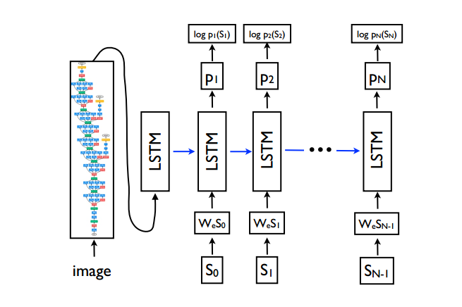

---
title: "Image Caption Generator"
layout: post
date: 2017-03-07
tag: image-caption
blog: false
project: true
star: false
author: karl
category: mxnet
description: image caption
---  

算法实现[Image Caption Generation](https://www.computer.org/csdl/proceedings/cvpr/2015/6964/00/07298935-abs.html)。算法框架如下图所示：　　

  

模型分为两部分：　　
* Image Encoder  
* Word Encoder and Decoder  

#### Image Encoder  

Image Encoder使用pretrain模型进行提取特征，算法中为vgg16，提取特征为fully-connected layer特征(batch_size, 4096)，其中输入图片大小为
(224, 224, 3)，因此需要在预处理阶段将图片进行resize。 

#### Word Encoder  
Word encoder使用Embedding layer将词映射为词向量，　word decoder使用LSTM进行decode。具体做法：　　
* 获取字典，由于caption较短，因此没有对词进行过滤，此时需要加入句尾标识"UNK",对应标签为-1。　　
* 获取单词到数字的映射，用于将句子映射为词向量。　　
* 对于一句caption，在映射为数字之后，需要embedding为低维词向量，避免one-hot高维稀疏，通过mxnet.sym.Embedding实现。　　

### 算法思想　　

模型组合可以看成简单的seq2seq模型，通常输入为一句话对应的词向量，为了简化模型，这里将image_encode_vector与词向量
拼接(因此要求图片向量长度与句子长度相同)，看做caption的第一个词(原来的第一个词变成了第二个词)，这样可以通过简单的模型得到我们想要的结果。　　

#### Train and Inference  

* 训练阶段，label为句子后移一个词的向量，对应模型输出outputs[1:],因为outputs[0]为image_encode_vector对应的输出,损失函数为Perplexity。　　

* 测试阶段与训练阶段类似。　　

* 生成caption主要通过beam search实现，常见与seq2seq模型中。

代码详见[mxnet_image_caption](https://github.com/saicoco/mxnet_image_caption)
