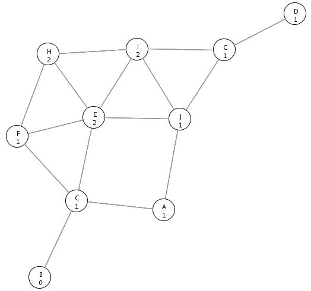
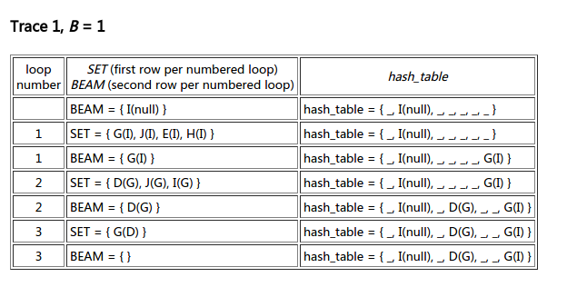

---
title: "Beam Search"
layout: post
date: 2017-03-13
tag: Algorithm
blog: true
star: false
author: karl
category: Algorithm
description: beam search
---  

最近在写image caption generator,写到inference阶段，即对于给定的图片，生成其对应的句子，通常有两种方法去生成句子。　　

* Sampling: 对于Sampling,原理即将image_encoding_vector作为RNN的第一层输入得出输出$$p_{1}$$，然后将$$p_{1}$$作为第二个入到RNN中，得到第二个输出，以此类推，知道输出语句结尾标志结束。　　

* BeamSearch：与上述得到第一个输出原理类似，不同在于利用第一个输出不断地得出候选词，直到最后得到句子结尾的标志。最终结果为获得多个候选句子。　　

本文主要讲解[Beam Search](http://jhave.org/algorithms/graphs/beamsearch/beamsearch.shtml)算法。  

### 伪代码　　

```
/* initialization */
g = 0;
hash_table = { start };
BEAM = { start };

/* main loop */
while(BEAM ≠ ∅){                             // loop until the BEAM contains no nodes
  SET = ∅;                                   // the empty set

  /* generate the SET nodes */
  for(each state in BEAM){
    for(each successor of state){
      if(successor == goal) return g + 1;
      SET = SET ∪ { successor };             // add successor to SET
    }
  }

  BEAM = ∅;                                  // the empty set
  g = g + 1;

  /* fill the BEAM for the next loop */
  while((SET ≠ ∅) AND (B > |BEAM|)){         // set is not empty and the number of nodes in BEAM is less than B
    state = successor in SET with smallest h value;
    SET = SET \ { state };                   // remove state from SET
    if(state ∉ hash_table){                  // state is not in the hash_table
      if(hash_table is full) return ∞;
      hash_table = hash_table ∪ { state };   // add state to hash_table
      BEAM = BEAM ∪ { state };               // add state to BEAM
    }
  }
}

// goal was not found, and BEAM is empty - Beam Search failed to find the goal
return ∞;
```
Beam Search算法由于有beam size大小的限制，使得该算法只能得到局部最优值。下面我们分析一下伪代码。　　

#### 变量说明　　
* `hash_table`用来记录搜索走过的路径；  
* `BEAM`表示候选后继节点(不能超过beam size，反之则保留前beam size个节点)；  
* `SET`用来存放某个节点的所有后续节点。　　

#### 算法步骤　　

1. 初始化`hash_table`, `BEAM`, `SET`如算法中所示，其中`hash_table`, `BEAM`初始化为起始节点；  
2. 获取当前BEAM中节点的后继节点，并存放与`SET`中；　　
    * 如果后继节点为目标节点，则结束搜索；　　
    * 反之，加入`SET`中，在`BEAM`中所有节点后继节点全部加入到`SET`中后清空`BEAM`;  
    
3. 根据一定的评价标准(如概率值由大到小)，从`SET`中获取BEAM_size个数节点：　　
    * 如果节点中没有被搜索过(即没被保存在`hash_table`中)，则保存与`hash_table`中；　　
    * 如果当前`BEAM`中节点个数未超过BEAM_size,则将其加入`BEAM`中；　　　　
    * 从`SET`中将该节点删除；

4. 重复以上步骤知道遇到目标节点或者BEAM已满。　　

### Example  

值得一提的是，对于获取后继节点的顺序，如果是先进先出，则是广度优先；先进后出，则是深度优先。下面用个例子来感受下算法：　

  

对于上图，假设搜索起始点为I, beam_size=1,那么搜索过程如下表所示：　　
  

上表中如果使用不同的遍历方法会得到不同的搜索结果，详细看[这里](http://jhave.org/algorithms/graphs/beamsearch/beamsearch.shtml)


