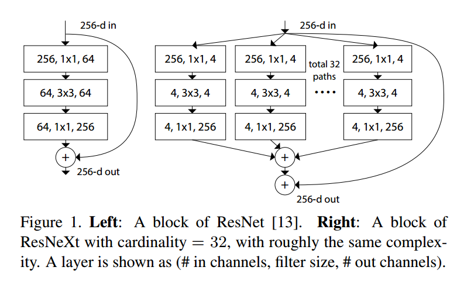
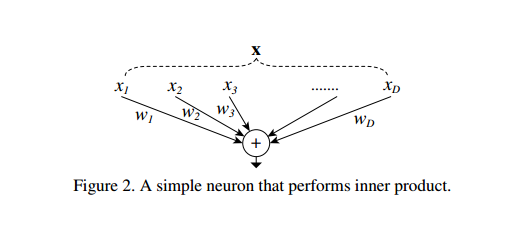
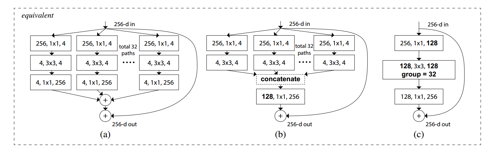

---
title: ResNeXt
layout: page
date: 2017-03-31
categories: 
- paper_reading
tag: paper
blog: true
start: true
author: karl
description: 多模态特征融合
header:
   image_fullwidth: "paper.jpg"
---  

## 前言

ResNeXt[^1] 是ResNet的改进版本，其设计目的是为了使得最终网络结构只需要较少参数设置，但可以获得
较好的效果: homogeneous, multi-branch是该框架的特点．而为了达到此目的，文章提出一个新的dimension
－－cardinality．在以前所见经典网络结构中，如VGG重复的简单框架加深depth,ResNet的residual连接增加
网络结构宽度，这里的cardinality则是除depth,width之外另外一个影响网络性能的因素．　　

## 传统网络结构　　


传统网络结构设计随着结构的复杂，超参变得越来越多，而这使得网络设计变得越发困难，尤其实在层数较多时．　　

* AlexNet[^4]使用并行的方式，即Grouped Convolution的方式，将输入进行分组操作，将最后的结果进行拼接．

* VGG[^2]的提出改变了设计网络思路，它通过简单但是有效的策略构建除了很深的networks(16, 19)：通过堆叠
相同的blocks达到深层网络的效果．  

* Inception-series网络思想：spliy-transform-merge，blocks中加入不同的kernels：blocks将输入分别分成几块，
$$1 \times 1$$的low-dimension embedding, $$3 \times 3$$, $$5 \times 5$$的transform, 还有最后的merge.  

* ResNet[^3]继承了VGG[^2]的思路，堆叠blocks的同时，加入residual连接增加网络宽度．最后达到100+的网络深度，
并在imagenet中达到state-of-the-art.  


以上的经典结构，分为两派：一派以VGG为主的简单重复堆叠blocks，另外一派则是对blocks的精妙设计，以达到较好的效果，当然以alexNet为核心细想的Grouped Conv的网络．　　

但是，对于精妙设计的Inception,其对于新数据需要重新调整各种参数才可达到较好效果，而VGG之类网络只需调整较少参数即可．ResNeXt就是秉承VGG/ResNets的策略，重复堆叠blocks，但与此同时，在blocks中用较为简单的方式实现split-transform-merge．　　

## ResNeXt  

#### Grouped Convolution  

  

如上图所示，左边为resnet, 有右边ResNeXt．可以看到，resnext分支更多，这里有32 brances, 但与我们平时的分支不同的是，他们共享参数，即对于一张32通道图片而言，我们将其分为32组，每组分别进行相同的操作，将得到的结果进行拼接，然后再进行參差连接．这里可以对比相同配置的50层ResNet和ResNeXt:  

  

根据上述，可以知道，在分组分别操作是，参数共享，因此，两个网络的参数数量是相同的，不同之处在于，对于一样的输入比如一张$$32*1000$$通道的图片，ResNet与ResNeXt的输出虽然均为256,但是ResNeXt在操作过程中每个通道的图片分别经过了$$1 \times 1, 128$$的low-dimension embedding，$$3 \times 3, 128$$的transform, $$1 \times 1, 256$$的非线性组合．在这个过程中，每个权重的被分为32份分别做
与输入的部分做卷积，可以如下图所示：　　

  

如此做的好处在于，通过Grouped Convolution，可以对输入进行选择性的操作：即第i份输入与第i个卷积weight做卷积操作．这样虽然最后结果大小与ResNet相同，但是得到的内容大为不同，应该更为丰富，学到权重也更具泛化能力．　　


#### Residual Connection  

  

上图为三种ResNeXt，其效果的等价的．我们可以看到的是，在blocks的输出之后，还有一个连接是与输入的残差连接,具体可以下式所示：　　
　　

$$
\begin{equation}
y = x + \sum_{i=1}^{C} T_{i}(x)
\end{equation}
$$  

这里值得一提的是，虽然ResNeXt中有类似Inception Module的思想，但是不同之处在于权重共享，并没有增加参数数量，拿图二来说，参数数量为：　　

$$
\begin{equation}
C \cdot (256 \cdot 3 + 3 \cdot 3 \cdot d \cdot d + d \cdot 256)
\end{equation}
$$

而ResNet参数数量为$$256 \cdot 64 + 3 \cdot 3 \cdot 64 \cdot 64 + 64 \cdot 256 \approx 70k$$  

这里我还特意翻出mxnet中对ResNeXt的实现：　　

```python
def residual_unit(data, num_filter, stride, dim_match, name, bottle_neck=True,
                  num_group=32, bn_mom=0.9, workspace=256, memonger=False):
    """Return ResNet Unit symbol for building ResNet
    Parameters
    ----------
    data : str
        Input data
    num_filter : int
        Number of output channels
    bnf : int
        Bottle neck channels factor with regard to num_filter
    stride : tupe
        Stride used in convolution
    dim_match : Boolen
        True means channel number between input and output is the same, otherwise means differ
    name : str
        Base name of the operators
    workspace : int
        Workspace used in convolution operator
    """
    if bottle_neck:
        # the same as https://github.com/facebook/fb.resnet.torch#notes, a bit
        # difference with origin paper

        conv1 = mx.sym.Convolution(
            data=data,
            num_filter=int(num_filter * 0.5),
            kernel=(1, 1),
            stride=(1, 1),
            pad=(0, 0),
            no_bias=True,
            workspace=workspace,
            name=name + '_conv1')
        bn1 = mx.sym.BatchNorm(
            data=conv1,
            fix_gamma=False,
            eps=2e-5,
            momentum=bn_mom,
            name=name + '_bn1')
        act1 = mx.sym.Activation(
            data=bn1, act_type='relu', name=name + '_relu1')

        conv2 = mx.sym.Convolution(
            data=act1,
            num_filter=int(num_filter * 0.5),
            num_group=num_group,
            kernel=(3, 3),
            stride=stride,
            pad=(1, 1),
            no_bias=True, workspace=workspace, name=name + '_conv2')
        bn2 = mx.sym.BatchNorm(data=conv2, fix_gamma=False,
                               eps=2e-5, momentum=bn_mom, name=name + '_bn2')
        act2 = mx.sym.Activation(
            data=bn2, act_type='relu', name=name + '_relu2')

        conv3 = mx.sym.Convolution(
            data=act2,
            num_filter=num_filter,
            kernel=(1, 1),
            stride=(1, 1),
            pad=(0, 0), no_bias=True,
            workspace=workspace, name=name + '_conv3')
        bn3 = mx.sym.BatchNorm(data=conv3, fix_gamma=False,
                               eps=2e-5, momentum=bn_mom, name=name + '_bn3')

        if dim_match:
            shortcut = data
        else:
            shortcut_conv = mx.sym.Convolution(
                data=data,
                num_filter=num_filter,
                kernel=(1, 1),
                stride=stride, no_bias=True,
                workspace=workspace, name=name + '_sc')
            shortcut = mx.sym.BatchNorm(
                data=shortcut_conv, fix_gamma=False, eps=2e-5,
                momentum=bn_mom, name=name + '_sc_bn')

        if memonger:
            shortcut._set_attr(mirror_stage='True')
        eltwise = bn3 + shortcut
        return mx.sym.Activation(data=eltwise, act_type='relu', name=name + '_relu')
    else:

        conv1 = mx.sym.Convolution(
            data=data, num_filter=num_filter,
            kernel=(3, 3), stride=stride, pad=(1, 1),
            no_bias=True, workspace=workspace, name=name + '_conv1')

        bn1 = mx.sym.BatchNorm(data=conv1, fix_gamma=False,
                               momentum=bn_mom, eps=2e-5, name=name + '_bn1')
        act1 = mx.sym.Activation(
            data=bn1, act_type='relu', name=name + '_relu1')

        conv2 = mx.sym.Convolution(
            data=act1, num_filter=num_filter,
            kernel=(3, 3), stride=(1, 1), pad=(1, 1),
            no_bias=True, workspace=workspace, name=name + '_conv2')
        bn2 = mx.sym.BatchNorm(data=conv2, fix_gamma=False,
                               momentum=bn_mom, eps=2e-5, name=name + '_bn2')

        if dim_match:
            shortcut = data
        else:
            shortcut_conv = mx.sym.Convolution(
                data=data, num_filter=num_filter,
                kernel=(1, 1), stride=stride, no_bias=True,
                workspace=workspace, name=name + '_sc')
            shortcut = mx.sym.BatchNorm(
                data=shortcut_conv, fix_gamma=False,
                eps=2e-5, momentum=bn_mom, name=name + '_sc_bn')

        if memonger:
            shortcut._set_attr(mirror_stage='True')
        eltwise = bn2 + shortcut
        return mx.sym.Activation(data=eltwise, act_type='relu', name=name + '_relu')


```

可以看到这里只要将平时的卷积中加入num_groups,然后加入残差连接即可．这里的实现便是等价图中的第三种．　　


## Reference  

[^1]: Xie S, Girshick R, Dollár P, et al. Aggregated Residual Transformations for Deep Neural Networks[J]. 2016.  

[^2]: Simonyan K, Zisserman A. Very Deep Convolutional Networks for Large-Scale Image Recognition[J]. Computer Science, 2015.  

[^3]: He K, Zhang X, Ren S, et al. Deep Residual Learning for Image Recognition[J]. 2015:770-778.  

[^4]: A. Krizhevsky, I. Sutskever, and G. Hinton. Imagenet classification with deep convolutional neural networks. In NIPS,
2012


