---
title: image caption中image feature的位置
layout: page
date: 2017-04-06
categories: 
- paper_reading
tag: paper
blog: true
start: false
author: karl
description: image_caption
feature: ../downloads/whereimg/feature.jpg
--- 

在image caption这个任务中，需要输入两种特征：image, word_vector,本文就两种特征融合的位置作讨论，同时也是阅读文章[^1]之后记录一下．  

# where to put image  
关于image的位置，即与word融合的位置，在文章中[^1]中做出了详细分类,从大方向上来看, 分为两类:  
* inject  
* merging  

而如果再细分，image与word混合输入RNN的情况又可以分为四种情况：　　
* Init-inject  
* Pre-inject  
* Par-inject  
* Post-inject
接下来我们就以上集中分类进行详细介绍．　　

## injecting VS. mergeing  
对于injecting和merging的理解，可以如下图所示：　　

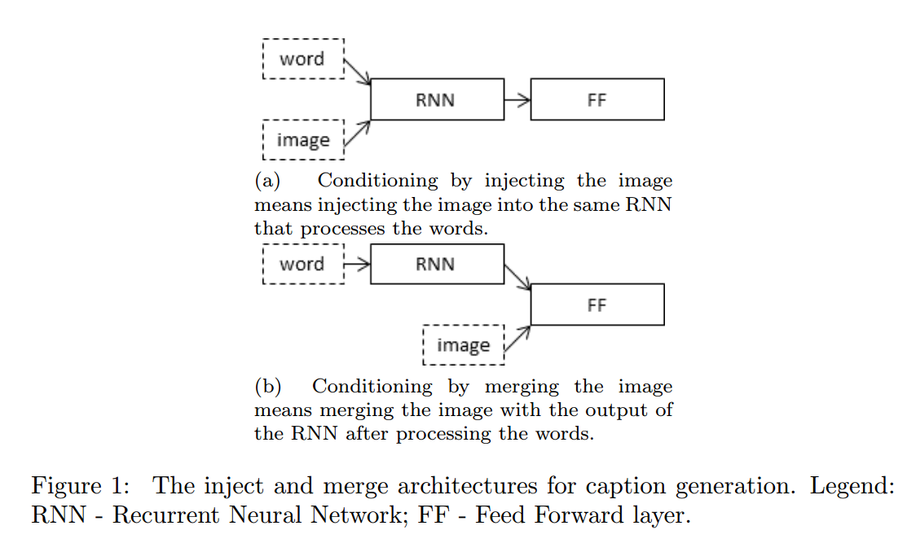  

这里需要说明，word为word_embedding vector,image为从pre-train模型最后一层fc层提取的特征，由上图可以看到，injecting更专注于word
与image的混合encode,而merging更倾向于单独对word编码，然后利用word高层表示与image进行＂融合＂．简而言之，如果image对于RNN encode
过程有作用，那么可以将其与word一起encode,反之，进行merging.关于merging,多为结合injecting来做，目的在于获取局部特征与全局特征，使得
最后用于预测的特征更为丰富，得到更准确的结果，因此这里只对injecting做简要描述．　　
　

## Injecting 
对于inject,主要在于word与image的组织形式，而这其中基本就是近几年image caption中论文的各种创新点．主要组织形式如下图所示：　　

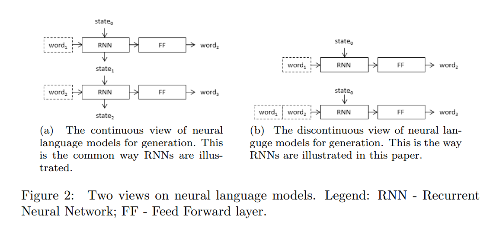  

接下来就结合各个论文做简明分析．　　

### Init-inject  
init-inject顾名思义，也如同上图所示，这里利用image作为RNN隐藏层向量的初始值，即初始`h_state = image`,而对于输入，则如同一般
seq2seq模型，输入为word vectors,输出为word vector后移一个单词，直到预测到<END>标志为止．　　

如liu et al.[^2]，文章创新之处在于利用Policy Gradient优化模型，可以算第一篇将强化学习应用于image caotion的文章．文章模型结构如下图所示：  

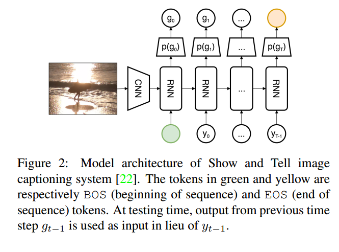  

抛去优化算法，损失函数的设计，我们这里只看模型结构，image来自CNN最后一层特征，直接作为RNN的隐藏层初始
值，图中绿色点表示句子起始标志，褐色节点表示句子结尾标志，$$P(g_i)$$表示预测函数．典型的init-inject model.  

同样的，xu et al.[^3]结构类似，使用LSTM作为编码工具，不同之处在于模型中加入attention机制，对于LSTM,可以如下面式子表示:  

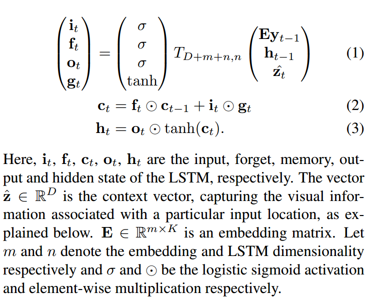  

如文中描述，$$z$$表示上下文的向量，来自原始图像中标注位置得到的注意力向量，而文中还提到，  
> The initial memory state and hidden state of the LSTM are predicted by an average of the annotation vectors fed through two separate MLPs (init,c and init,h):  
$$
\begin{equation}
c_0 = f_{init, c}(\frac{1}{L} \sum_{i}^{L}\alpha_i) \\
h_0 = f_{init, h}(\frac{1}{L} \sum_{i}^{L}\alpha_i)
\end{equation}
$$  

有上面式子可以知道，对于lstm的初始化隐藏层向量，都是用图像特征初始化的(经过fc层endoce使得维度与word相同)．而其网络结构可以如下图表示，虽然细节只能从公式中观察．　　

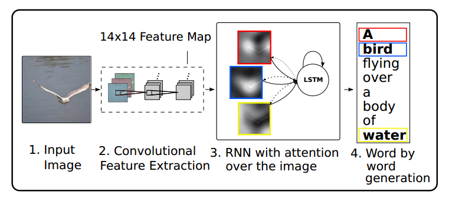    

而Yang et al.[^4]使用同样的方法初始化RNN$$h$$向量，如下图所示：  

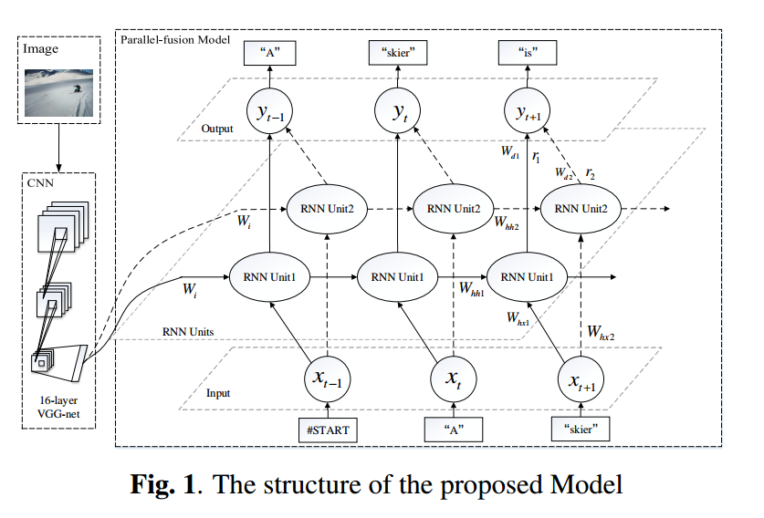  
不同之处在于其使用两个并行的RNN对word进行encode,然后在decode阶段将两个RNN进行fusion.  
对于init-injecting典型是上述几篇文章，有些文章可以参看文章[^1]中的引用文献，结构类似，掌握思想即可．

### Pre-inject  
Pre-inject则将image作为RNN的第一个输入，可以将其视为第一个单词，隐藏层初始状态为随机初始化．　
如Krause et al.[^5]提出的模型，如下图所示：　　
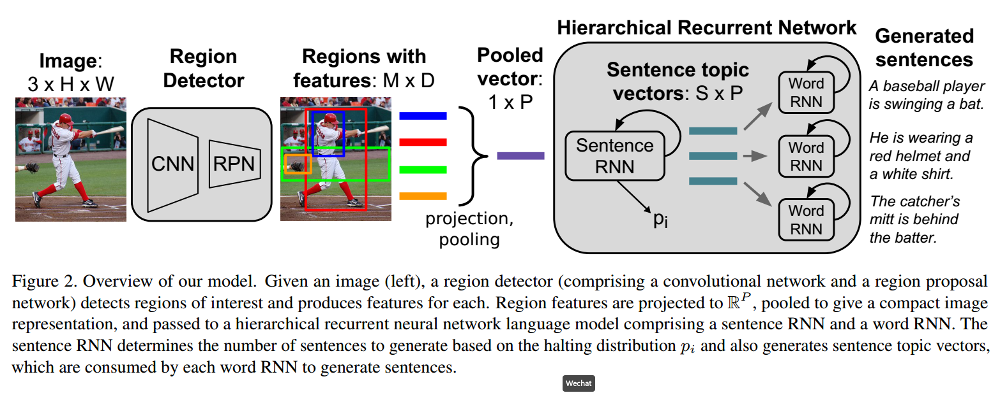　  
如果只关注RNN部分，可以看到有两种RNN: Sentence RNN, word RNN;其中sentence RNN接受来自Region Pooling的图像部分的输出作为输入，而隐藏层变量$$h_0$$,$$c_0$$都初始化为0, sentence RNN的输出有两种用途：其一用作预测当前状态，继续还是停止(生成word状态);另外一种用途则通过两层fc layer生存topic, 然后输入到word RNN中．文章使用了目标检测的手法提取图片区域的特征，然后进行后续的encoder-to-decoder的操作．  

Rennie et al[^6]同样使用image feature作为RNN的第一个输入，一图胜千言：　　

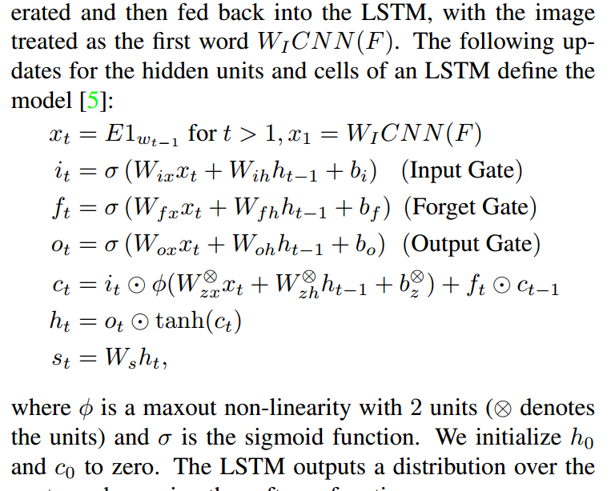  
可以看到，image feature作为word的第一个向量，后续则与传统模型类似，文章创新之处在于image feature的选取，注意力机制，模型优化算法，具体参看文章．　　

Vinyals et al.[^7]就是我们常说的google NIC模型，该模型也是将image feature插入至word第一个向量:  
  
很直观，这篇文章算很典型的一个模型，引用率蛮高．实现也较为简单．　　

Wu et al.[^8]则发现，上述模型image feature通过pre-train的模型提取，不具有针对性，即提取的特征与分类相关，未必适合caption任务，模型
结构图如下图所示：　　

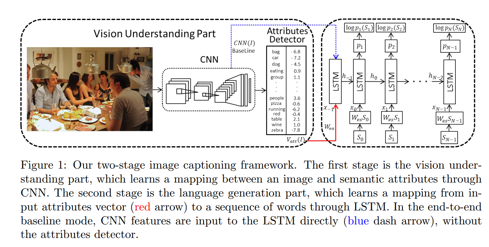  

首先利用caotion中的关键词，比如dog, car等这些word中的关键词作为类别信息，fine-tune模型，好处在于这样提取出的image feature与关键词是紧密相关的，还有一处创新点，就是在fine-tune过程中，作者将这个过程视为one-vs-all,没有使用softmax分类器，而是使用svm, 文章说道，caption中出现的关键词，即类别他们之间没有非此及彼的关系，比如这句话：＂一只狗蹲在车旁边＂，这里狗和车是可以同时出现的，并且不会因为狗的概率增加而压缩车出现的概率，所以选择SVM分类器，如此一来，对caption更具有针对性，而且其LSTM的第一个输入为image feature,做法与NIC相同.  　　

Yao et al.[^9]则是提出了image与word的组合关系，提出的模型可以覆盖inject的后面三种情况：pre, par, post:  

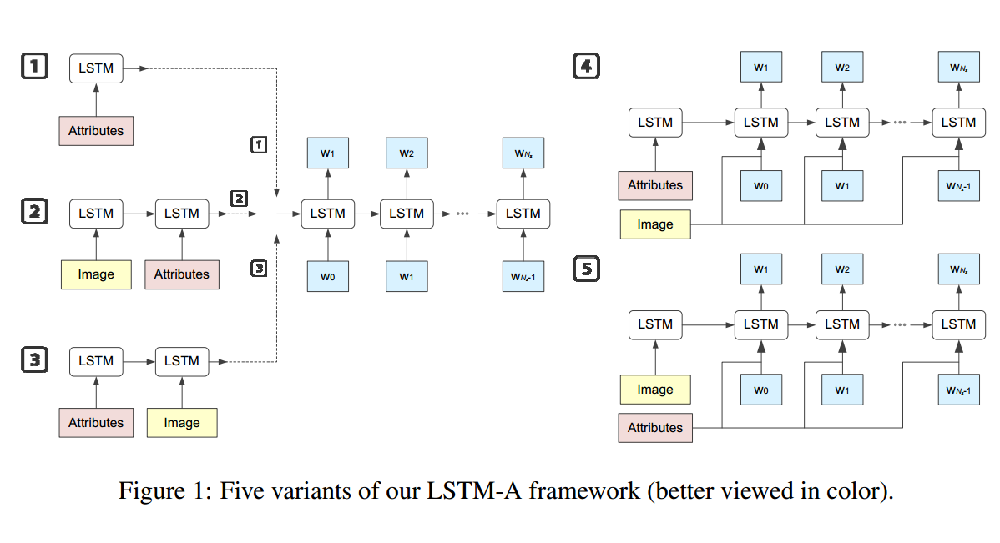  

上图中，image和attribute分别指来自pre-train模型的fc feature和该特征对应的概率．图中给出五种组合方式，成为boosting.  

### Par-inject  
Par-inject可以理解为pair-inject,及每次输入一个词时需要同时输入image,RNN每次接受两个向量．　　

Donahue et al.[^10]提出的模型如下图所示：　　
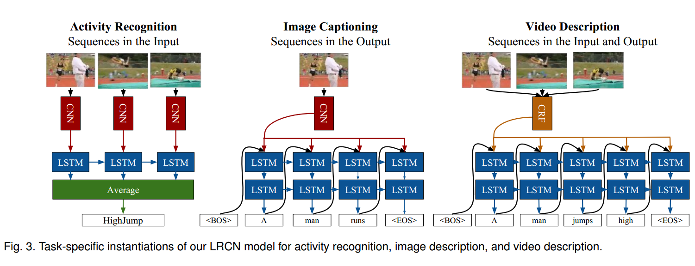   
模型接受image, word组合输入，然后预测word,而且同时还提出了视频caption的生成模型．  

Karpathy et al.[^12]提出的对齐模型，　　
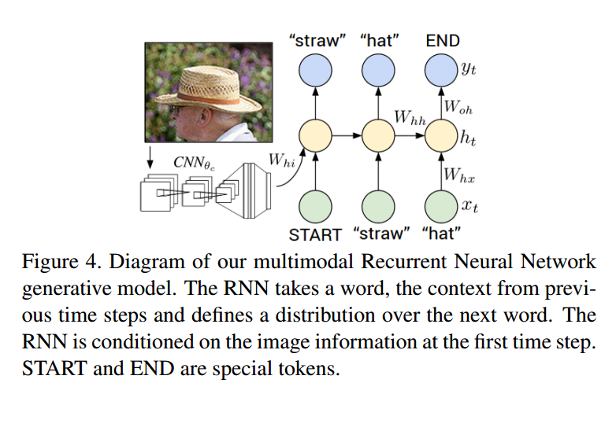   
利用目标检测算法检测图片中目标内容，使得caption与目标对齐，而目标与word的融合方式如上图所示．　　

Sah et al.[^14]提出模型如下图所示：　　
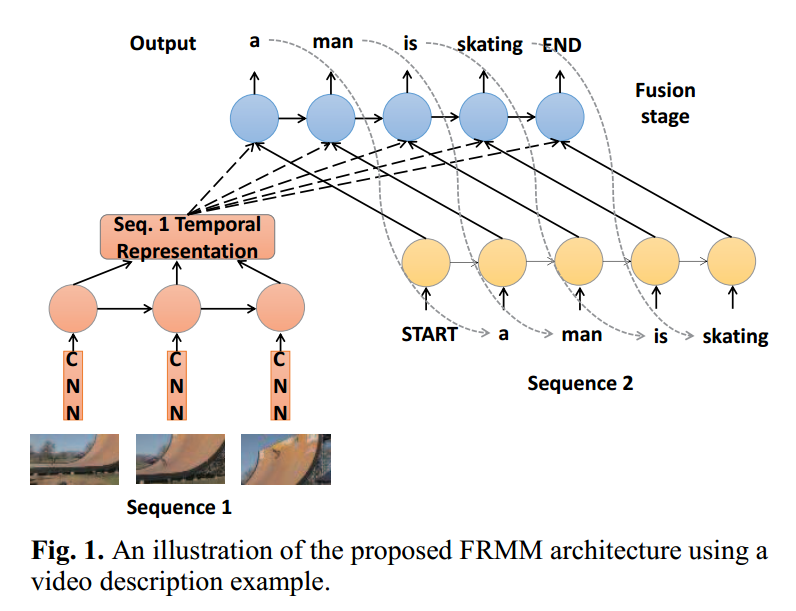   
换汤不换药，模型结构类似，不同之处也是image feature的获取，这里获取的时序特征，结合word，最后旨在获取word与Image的时序关联．　　

Zhou et al.[^13]则是提出如下模型：　　
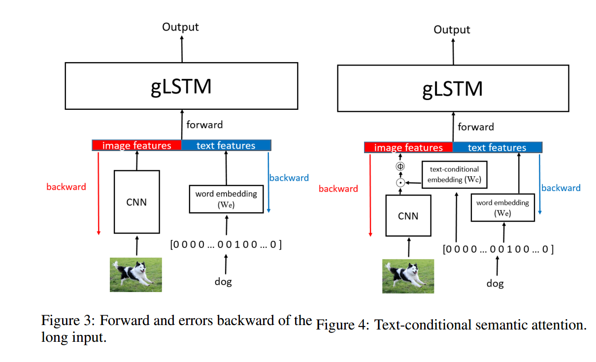  
如上图右边所示，在image feature的输入之前加入word的信息，这样得到的Image feature偏向文本，使得最后的decode阶段得到的word更为准确．

同样的xu[^2]在每次lstm过程中都输入了attention vector,可以是一种par-inject,可以参看上面公式，还有Yao[^9]几种boosting结构，都存在par-inject.
 
----  
## where to put image  
在描述一些经典结构之后，文章将各路算法综合做了对比，并设计了对比试验，其框架如下图所示：　　

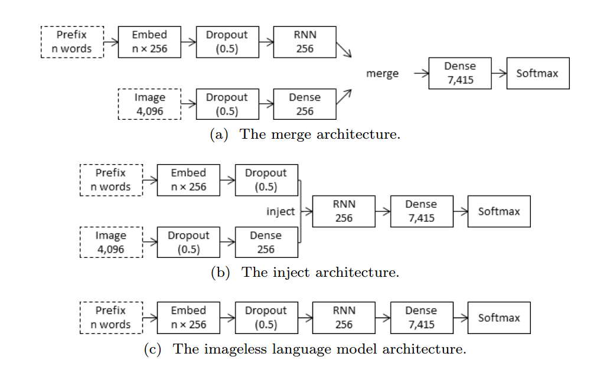  

所有的结构参数相同，唯一不同的在于image插入的位置．如此做的原因在于，以往模型之间的对比往往不会使用完全相同的结构，而且有的模型相当多的
tricks,所以不足以说明image的位置对于最后结果的影响，因此文章控制无关变量，使用相同设置进行试验．  

　　
对于merge使用三种哦个方式:  
* add  
* mul  
* concat  

对于inject则使用：　　
* init  
* pre  
* par  
* post  

以上为两种对比的内部组合方式，而对于特征，image特征使用vgg最后一层fc层特征，未使用多层特征组合的方式;word特征使用word embedding层获取word 
vector,但是没有使用glove等训练好的词向量，而是直接嵌入到模型中，使得embedding layer可以学习到有用的词向量映射．以下为训练配置：　　

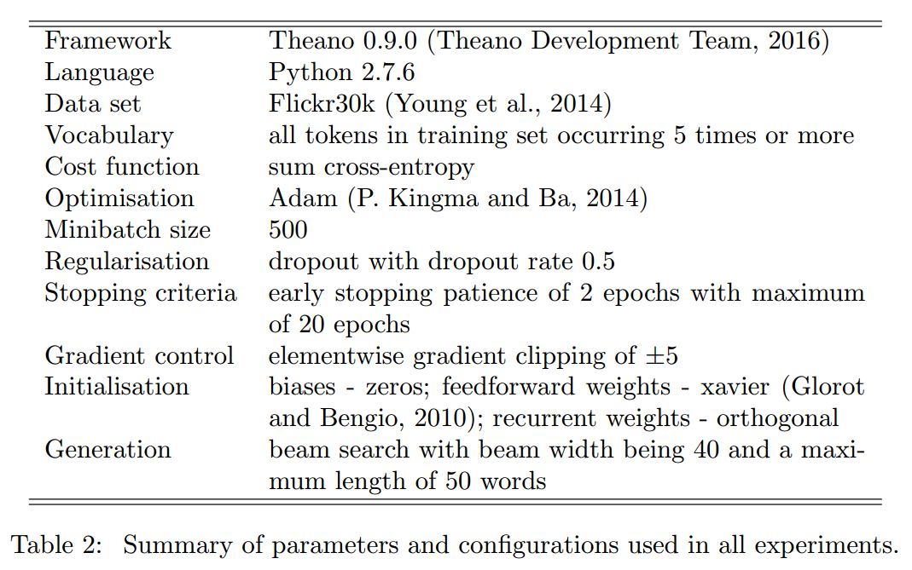   

这里使用数据集为Karpathy的数据集[flickr30k](http://cs.stanford.edu/people/karpathy/deepimagesent/)，当然也有coco等提取好的数据．训练过程如下：　　
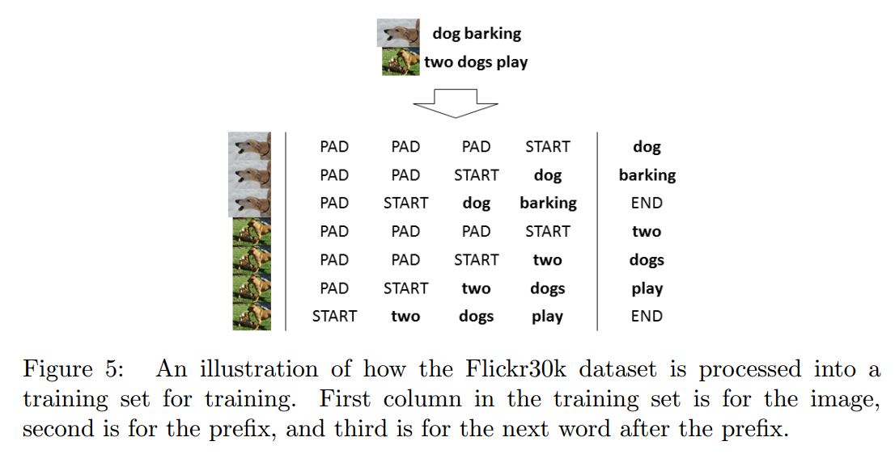  
prefix表示当前输入caption,target为caption后移一个词得到，数据组合形式及一张图片配一个词，这样利于后续的inject中pair的实现．下面为对image 位置的结果的总结：　　
> If we take the late binding architectures, merge and post-inject, and the early binding architectures, init-inject and pre-inject, as two groups, then there is a clearly discernible pattern for both the models using a simple RNN and those using an LSTM: given the same RNN type, late binding architectures perform better than early binding architectures with mixed binding architectures (parinject) floating somewhere in the middle.  
经实验文章得出结论Image位置靠后对结果提升有好处，即merging比inecting会好一些：　　

> Our conclusion, however, must be that models in which image features are included early in the generation process perform poorly, relative to those models based on injecting or merging image features later.  

对于image与word混合输入RNN,对于RNN最后的编码并不是最佳，因为image中的噪声可能影响学习过程，而这也是NIC模型使用pre-injecting的理由，认为par-injecting方式会不断的将图片信息混入RNN中，影响最后的结果．而从inject中的模型可以看出，不论是目标检测获取Image Feature,还是使用多层图像
特征混合作为最后的图像特征，或是使用SVM微调网络，目的都在于丢弃噪声，使用更为有效的图像特征，而这也是避免图像对RNN学习影响的手段，而对于word部分，基本都是encoder-to-decoder．而这可能就是merging对于最终结果有利的原因，没有参与word的编码过程，只是在语义层进行影响最终的word预测．Image caption的任务难点：word与Image feature的交互，最后语言的生成．解决这两个问题的方式，就是提出上述模型的思维过程．

## Reference  

[^1]: Marc Tanti, Albert Gatt, Kenneth P. Camilleri. Where to put the Image in an Image Caption Generator[J]. 2017.  
[^2]: Liu S, Zhu Z, Ye N, et al. Optimization of image description metrics using policy gradient methods[J]. 2016.  

[^3]: Xu K, Ba J, Kiros R, et al. Show, Attend and Tell: Neural Image Caption Generation with Visual Attention[J]. Computer Science, 2015:2048-2057.  
[^4]: Wang M, Song L, Yang X, et al. A parallel-fusion RNN-LSTM architecture for image caption generation[C]// IEEE International Conference on Image Processing. IEEE, 2016.　　
[^5]: Krause J, Johnson J, Krishna R, et al. A Hierarchical Approach for Generating Descriptive Image Paragraphs[J]. 2016.  
[^6]: Rennie S J, Marcheret E, Mroueh Y, et al. Self-critical Sequence Training for Image Captioning[J]. 2016.　　
[^7]: Vinyals O, Toshev A, Bengio S, et al. Show and tell: A neural image caption generator[J]. Computer Science, 2015:3156-3164.  
[^8]: Wu Q, Shen C, Hengel A V D, et al. Image Captioning with an Intermediate Attributes Layer[J]. Computer Science, 2015.  
[^9]: Yao T, Pan Y, Li Y, et al. Boosting Image Captioning with Attributes[J]. 2016.   
[^10]: Donahue J, Hendricks L A, Guadarrama S, et al. Long-term recurrent convolutional networks for visual recognition and description[C]// Computer Vision and Pattern Recognition. IEEE, 2015:2625-2634.　　
[^11]: Hessel J, Savva N, Wilber M J. Image Representations and New Domains in Neural Image Captioning[J]. Computer Science, 2015.  
[^12]: Karpathy A, Fei-Fei L. Deep Visual-Semantic Alignments for Generating Image Descriptions[J]. IEEE Transactions on Pattern Analysis & Machine Intelligence, 2015, 39(4):664.  
[^13]: Zhou L, Xu C, Koch P, et al. Image Caption Generation with Text-Conditional Semantic Attention[J]. 2016.  
[^14]: Oruganti R M, Sah S, Pillai S, et al. Image description through fusion based recurrent multi-modal learning[C]// IEEE International Conference on Image Processing. IEEE, 2016:3613-3617.  
[^15]: Donahue J, Hendricks L A, Rohrbach M, et al. Long-term Recurrent Convolutional Networks for Visual Recognition and Description[J]. IEEE Trans Pattern Anal Mach Intell. 2016, PP(99):2625-2634.
